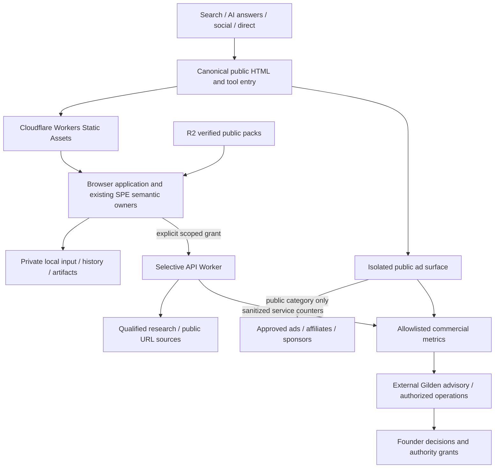

# SPE Revenue-First Web Architecture — Design for Founder Review

Date: 2026-10-04. Status: written-spec stage; implementation and release are not authorized.
Repository: `jaitleystudio-cpu/system-prompt-engine`.
Documentation baseline: fetched `origin/main`, `3abe3df936082296b6a1ddc94923d757129cfdff`.
Qualification reference: R5/R6 convergence ancestry `29a4d7139e5194a9b365a0b25b5d25df1e06c22e`, inspected separately; it is not merged into this branch.

## 1. Mission, authority and scope

SPE is a free, online-first consumer web product at **https://systempromptengine.com/**. Advertising and affiliates are the primary early revenue engines. B2B/API/OEM, ads and affiliates are the primary mature engines, with direct sponsorship, optional compute, marketplace commissions and other approved commercial services retained in the Revenue Mesh. Optimize sustainable contribution and user value, not raw ad count. Production spending is permitted when it protects reliability, profit or revenue; spending still needs a founder-approved budget.

Local means processing on the user's browser/device while using SPE. It does not mean positioning the complete consumer product as a permanent standalone offline download. Preserve free core libraries, local execution, caches, PWA installation, local history and user-owned exports. Revenue strategy must not remove, defer or reclassify founder-approved features, force cloud inference, trap exports, or make the free core paid.

This document specifies delivery and monetization around existing semantic owners. It creates no alternative compiler, research fabric, privacy authority, Gilden implementation or capability registry. It neither changes runtime behavior nor qualifies any product claim. The authorized output is this spec and its source note, committed on a new documentation branch. Main merge, hosting, deployment, production changes, purchases, account enrollment and public release remain outside this authorization.

Requirements use **MUST** for invariants and **SHOULD** for recommendations whose exceptions require a documented rationale. Qualification HOLD is an evidence state, never permission to cut the corresponding feature from approved scope.

## 2. Evidence custody and design notes

| ID | Source and inspected identity | What it supports and its limits |
| --- | --- | --- |
| S1 | Approved chat, [Release candidate hold adjudication](chatgpt-conversation://6ac23c0e-d4d8-83ee-8313-77a257f8c7e7), particularly founder approvals and the final architecture-spec handoff | Approved business direction and stage boundary. Prior assistant claims are supporting context, not proof of runtime or revenue. |
| S2 | [Uploaded planning source](../design-notes/2026-10-04-spe-revenue-planning-source.txt), SHA-256 `2805b872682b677fd35e16c8d544d519052ede993cc67993e6e763f28e2ca568` | Exact recovered `Pasted text.txt`, copied byte-for-byte from the chat attachment preview. Original requested `/mnt/data/Pasted text.txt` was unavailable locally. Scenario assumptions and channel arithmetic, not guaranteed rates or current financial statements. Embedded content-reference tokens are unresolved source citations and are not independent evidence. |
| S3 | [Zero-Cost Product Law](../../ZERO_COST_PRODUCT_LAW.md), baseline SHA above | Free local core, no prompt SKUs in core, no core ad SDKs, offline and zero-paid-service Sprint proofs. |
| S4 | [Human Perspective constitution](../../human-perspective/CONSTITUTION.md), [web CSP notes](../../implementation/WEB_CSP.md), [language qualification](../../FUTURE_LANGUAGE_QUALIFICATION.md) | Agency, truthful copy, no hidden profiling; same-origin execution policy; preservation of authority/privacy/provenance and honest capability states. |
| S5 | `apps/web/public/sw.js`, `manifest.webmanifest`, `_headers`, `index.html`, baseline SHA above | Existing PWA shell/WASM caching, network-first navigation fallback, private-body exclusion and restrictive CSP. No Cloudflare configuration, sitemap or robots files found in tracked baseline inspection. This is source inspection, not a deployed-host audit. |
| S6 | Convergence checkout at `29a4d71…`: `apps/web/src/routing.ts`, `landing/Hero.tsx`, `builder/websiteSpecModel.ts`, `research/ResearchRoute.tsx`, canonical transport/engine owners | Candidate routes and explicit noindex separation; offline promotional wording still exists; candidate integration must not be described as main or production behavior. |
| S7 | R6 local inspection receipts: `/private/tmp/spe-r6-p04/browser_matrix.json` (`e2f0c5d6e3f311dd029d131ef6915b71d9a00bed6a166428e51a22af0122fd06`), `webgl_matrix.json` (`31eba8cd08b25b690f42fe6c43c0a1ba071cc77e626235aff1568fbd383999e0`), `/private/tmp/spe-r6-copy-check.json` (`852d9e3aa298934b269a502ca0357dbf817a143670164cb43ab4e3b5831968d4`) | Local, temporary, bounded receipts; not re-executed here and not a release verdict. Browser matrix uses `29a4d71…`; WebGL matrix uses `1dee580038d7b906426499866a87202c84e8f6fd`. They cannot be combined as qualification of one candidate. Copy scan reports 889 unreviewed candidates out of 3301. |
| S8 | GitHub read-only PR metadata checked 2026-10-04: #103 localization HOLD; #106 SEO no-merge; #108 privacy HOLD; #111 public .spe HOLD; #113/#115/#116 website/media/shell restricted candidates | Open lane work remains separately owned. PR titles are triage signals; full qualification requires exact heads and receipts. No merge or release approval follows. |
| S9 | Localization owner reference `spe-c9r-l10n`, `packages/web-runtime/src/locales.ts` at inspected local head `a6d6866…` | Language, script, region and direction are separate. Nine entries in the inspected locale registry do not prove 32-language UI or modality qualification. Preserve 32-language distribution as approved scope. |

S2's statement of pre-launch/$0 shown is historical evidence supplied with the planning model. This spec has not audited bank accounts, contracts or the current production domain and makes no verified-current revenue claim. S2's INR values use an old FX snapshot, not a current exchange rate. USD is the scenario currency here.

External primary documentation checked on 2026-10-04:

- E1: [Cloudflare selective Worker routing](https://developers.cloudflare.com/workers/static-assets/routing/worker-script/) and [Static Assets billing](https://developers.cloudflare.com/workers/static-assets/billing-and-limitations/).
- E2: [Workers pricing](https://developers.cloudflare.com/workers/platform/pricing/), [platform limits](https://developers.cloudflare.com/workers/platform/limits/) and [R2 pricing](https://developers.cloudflare.com/r2/pricing/). Vendor terms must be refreshed before a spending or deployment decision.
- E3: [Ad placement policies](https://support.google.com/adsense/answer/1346295), [AdSense program policies](https://support.google.com/adsense/answer/48182) and [Google publisher consent requirements](https://support.google.com/adsense/answer/13554116). Contextual delivery is not an automatic consent exemption.
- E4: [Localized versions](https://developers.google.com/search/docs/specialty/international/localized-versions), [AI search features](https://developers.google.com/search/docs/appearance/ai-features), [noindex](https://developers.google.com/search/docs/crawling-indexing/block-indexing), [spam policies](https://developers.google.com/search/docs/essentials/spam-policies) and [Web Vitals](https://web.dev/articles/vitals).
- E5: Werner, Adam and Benlian (2022), [Empowering users to control ads and its effects on website stickiness](https://link.springer.com/article/10.1007/s12525-022-00576-6). Full article inspected, including method and limitations. One experimental news-page visit and intention measures cannot establish SPE retention or financial lift; reduced ad quantity may reduce immediate inventory.
- E6: Häglund and Björklund (2024), [AI-Driven Contextual Advertising](https://doi.org/10.1080/10641734.2024.2334939). Publisher metadata found; full text unavailable in this audit. Its title is not proof of SPE effectiveness or a license to inspect private content. No quantitative effect is imported.

## 3. Law reconciliation and precedence

| Existing rule or behavior | Binding reconciliation | Consequence |
| --- | --- | --- |
| Free core library and universal ABI | Remain free to build/run locally | Consumer website positioning does not restrict the library or erase its local execution rights. |
| ₹0 owner spend for core development/conformance | Keep Sprint proofs reproducible without paid cloud, models, analytics or CI | Production hosting and commercial services may use approved paid plans; production cost is a separate ledger. |
| No prompt sales / prompt marketplace in core | Remains intact | Marketplace stays in approved scope, with templates, scenes, packs and workflows outside core. Prompt-only SKU activation requires founder resolution in section 16. |
| No advertising SDKs or targeting in core | Remains intact | Ads belong to isolated web presentation components, never semantic/compiler libraries or private workspace execution. |
| Private content, authority and trust protections | Remain stronger than revenue optimization | Prompt/audio/image/video/document/research content, derived outputs, embeddings and sensitive metadata are never ad-targeting data. Consent to research or compute is not consent to advertising use. |
| `network_mode=NONE` conformance | Preserve offline proof mode | Online website delivery does not add network to semantic conformance. Provisioning, local execution, consented retrieval and advertising have distinct receipts. |
| Cached shell works offline | Preserve resilience and saved artifacts | Stop standalone-offline consumer promotion; do not add remote locks, wipe caches or sabotage completed local work. |
| Human Perspective / honest capability states | Preserve dignity, agency and uncertainty | No guilt retention, hidden profiling, fake ranking, fabricated benchmark or promotion of UNKNOWN to PASS. |

The approved revenue-first direction defines the intended production business policy; it does not silently rewrite S3 or authorize runtime changes. This spec is a proposed reconciled interpretation for founder review. An actual conflict with a frozen law must be resolved by a narrow founder amendment, not bypassed through a new subsystem.

Existing K0–K7, ProtectedIntent, K3, K4, Quality, XCAT, grounding/ContextNeed/ContextCapsule, universal ABI, artifacts and lineage retain their owners. A presentation label, export file or successful build cannot prove target-model semantic binding. Preserve I1 and do not start I2 under this design authorization. Use existing compiler seams; if they cannot lawfully preserve continuation/grounding data, keep `HOLD_COMPILER_SEAM`.

## 4. Requirements and preserved product scope

| ID | Requirement | Acceptance evidence |
| --- | --- | --- |
| R01 | Free online consumer core on canonical apex; browser-local computation remains preferred where qualified | Approved copy plus complete free journeys, including export and ad failure |
| R02 | All founder-approved features and seven pillars remain in scope, without downgrade or substitution | Requirement-to-owner-to-test ledger and founder comparison |
| R03 | Zero private-content use by ad/affiliate/sponsor/analytics systems | Deny-list mutation tests, cross-origin isolation and scoped transport traces |
| R04 | Asset-first delivery; selective APIs; R2 public resource plane | Route inventory, negative routing tests, invocation and byte accounting |
| R05 | One semantic architecture and existing capability registry | Owner review; no duplicate compiler, Gilden, research or locale registry |
| R06 | SEO/AEO/GEO with useful public HTML and 32-language global distribution | HTML, canonical, hreflang, quality and per-language capability checks |
| R07 | Revenue and costs are measurable separately from assumptions | Ledger reconciliation, denominator checks, refunds and cash reports |
| R08 | PWA installation, cache resilience, private history and exports survive | Cold/warm/update/offline/revocation tests without data loss |
| R09 | Ad policies, consent and accessible placements gate commercial activation | Vendor review, adversarial placement tests and accessibility evidence |
| R10 | R6 and later R8 qualification cannot be bypassed | Exact-candidate proof package, independent verification and founder gates |

### Seven acquisition pillars

| Pillar (preserved scope) | Canonical public intent route | Tool continuation / owners | Public commercial context |
| --- | --- | --- | --- |
| Audio → Text | `/audio-to-text` | Existing media/ASR pipeline, semantic core | Audio software, microphones, meeting tools |
| Video → Text | `/video-to-text` | Existing media/video pipeline, semantic core | Captioning, editing, creator tools |
| AI + 3D Website creation | `/3d-website-builder` | Website builder, SceneIR/renderer, existing exports | Domains, hosting, design resources |
| System Prompt Engine | `/system-prompt-generator` | Create, ProtectedIntent, K0–K7, adapters | AI/developer tools |
| Screenshot → Code / URL → Site | `/screenshot-to-code`; distinct `/url-to-website` intent | Vision, WebRecon, code/website owners | IDEs, testing, hosting |
| Image → Prompt | `/image-to-prompt` | Existing image observation/semantic pipeline | Creative software and assets |
| Research → Prompt | `/research-to-prompt` | Existing research fabric, ContextNeed/Capsule, K3 | Scholarly and learning tools |

Documents, media capture/import, OCR, multilingual speech, translation and spoken output, provider adaptation, local history/project library, workflow/export, `.spe`, authority/evidence hub, benchmark/reliability work, Daily Lab, native 3D storytelling and accepted visual motifs remain preserved. Theme, accessibility, reduced motion, RTL, no-account access where already supported, and user-controlled sharing remain required. This table groups acquisition; it is not an exhaustive replacement feature list. Attach the existing full founder requirement ledger to any implementation plan and retain every requirement ID. A missing baseline mapping is a HOLD on planning completeness, not permission to delete scope.

Repeat visits must come from useful new templates, 3D examples, research, verified benchmarks, provider updates and recurring workflows. A fixed curated queue must be labeled as fixed; do not claim fresh daily research or an endless feed without publication evidence. Retention must not depend on artificial page breaks, forced refreshes, lost exports or mandatory ad clicks.

## 5. Components and trust boundaries

There is deliberately no data-flow edge from private local storage or semantic outputs to Ads, Vendors, Metrics or Gilden. Research/compute disclosures are purpose-specific and never reused commercially for targeting.

| Component | Responsibility and interface | Exclusions |
| --- | --- | --- |
| Public route/content build | Produce deterministic HTML, metadata, locale links, evidence pages and static assets | Private artifacts, live research queries, ad profiling |
| Browser SPE | Existing input, compiler, privacy/authority, artifact, local media and preview interfaces | Third-party ad SDKs and payment secrets |
| Selective API Worker | Validate scoped requests, grants, allowed destinations, budgets and safe evidence responses | General proxying; unconsented input upload; ad inference |
| R2 resource plane | Immutable public model/runtime/demo/dataset packs with manifests | Default storage of user uploads or generated work |
| Commercial presentation | Category-selected approved placements and disclosed affiliate links | Reading input DOM, OPFS/IndexedDB, artifacts, clipboard or semantic state |
| Analytics/finance | Allowlisted counters, partner settlement and cost reconciliation | Session replay, free text, raw URLs, fingerprints or private-content hashes |
| External Gilden | Consume sanitized commercial reports; propose/perform only granted operations | Semantic-core ownership; automatic founder authority; private-content access |

Browser isolation is mandatory, not a promise by an ad SDK. Public marketing/editorial pages may host approved vendor scripts only in an isolated ad execution surface. Private input and artifact surfaces MUST remain on a separate security principal from third-party script execution. The intended adapter is a cross-origin ad frame hosted on an isolated commercial origin, with sandboxed capabilities and explicit CSP. That origin gets no SPE authentication cookies, local storage, raw referrer, user files or opener access. Domain-wide cookies are forbidden.

Pass only versioned public route/category IDs, locale and placement ID through an origin-checked message schema; reject unknown keys and wildcard target origins. Private workspace pages send no ad context messages and load no ad scripts. User-driven navigation from public content to the tool is ordinary SPE navigation, never an advertiser-required redirect. Vendor scripts MUST NOT execute in the same document/security principal as private work. If a network requires that arrangement or forbids the proposed frame integration, use a compliant public editorial placement or another approved channel; hold that vendor integration until section 16 is resolved. Do not disguise a vendor's prohibited integration as an iframe workaround.

Generated previews and acquired HTML are untrusted, separately sandboxed, and denied ad/analytics/storage access. Prompt injection in retrieved content cannot create grants, payments, publication or ad inventory. Server secrets remain Worker-side; BYOK keys stay in their existing owner-controlled path and are excluded from logs and commercial reporting.

## 6. Data flows and purpose separation

1. **Public acquisition:** a visitor requests canonical HTML → static edge response → usable explanatory content/tool entry → policy-eligible contextual placement. Selection uses editorial route category, never their private query or inferred intent. Cookies/SDK storage require applicable consent; rejection leaves the free tool accessible.
2. **Private work:** user supplies text/media/document → existing local input owner → canonical semantic pipeline → local artifact → user-controlled export/history. No ad bridge receives filenames, transcripts, extracted text, output or content-derived labels. Downloading an artifact is not downloading SPE itself.
3. **Provisioning:** user chooses capability/pack → show actual download/storage size → approved resource manifest → CDN/R2 ingress → size/hash/license/runtime verification → atomic local install → qualified local inference. Cancelled/failed packs remain unusable, with resumable staging where safe. Model ingress and input egress are measured independently.
4. **Live research/WebRecon:** explicit scoped grant → user-reviewed minimized query or public URL → API validation → destination/redirect/SSRF, size, type, time and budget bounds → source evidence → existing research/observation owners → compiler seam. Absent/revoked grant, `source_mode=OFF` or prohibited privacy class means no request. Private acquisition cannot be made public merely by redacting one field. Untrusted source instructions remain data.
5. **Affiliate:** user deliberately opens a clearly disclosed public offer → fixed approved partner URL with a campaign ID → partner aggregate settlement. Never attach prompt text, filenames, research question, session artifact ID or private query parameters. Clicks are not conversions; settlement reversals update earnings.
6. **Optional compute/B2B:** user/business chooses a service with explicit price, provider, payload, retention and cancellation terms → existing authority/privacy owner approves → scoped API/service → artifact returns → separate finance ledger. Core local/BYOK routes remain free and usable. No silently paid fallback.
7. **Commercial reporting:** coarse event allowlist → validation/aggregation → earnings/cost reconciliation → sanitized Gilden report → bounded recommendation or authorized experiment. Contracts, invoices and payment records live in commercial custody, not ad profiles or research capsules.

## 7. Ad placement and policy rules

The initial design cap is one visible ad placement per viewport and at most two reserved placements per public page; this is a conservative design choice, not an asserted policy minimum or revenue optimum. A later increase requires founder-reviewed experiment evidence. All placements reserve space before loading, have accessible localized labels, and remain distinguishable from SPE controls.

| Surface | Intended rule |
| --- | --- |
| Public tool description / pillar / learn / evidence page | One side placement on wide screens or one in-flow placement after useful introductory content on narrow screens; optional disclosed partner block after public content |
| Public examples and Daily Lab | Public editorial category only; no overlay on 3D interactions; maintain reduced-motion and keyboard access |
| Private editor, input, saved history, results and generated previews | No third-party ads or targeting; offer links only via a separate public commercial page the user chooses to visit |
| Upload, record, generate, copy, export, consent and error controls | No adjacent look-alike ad buttons, overlap, deceptive downloads, focus interception or layout movement that produces accidental clicks |
| Extension / native software | No AdSense in extension/toolbars/desktop apps; separately approved disclosed sponsorship/affiliate/house-card paths, with voluntary web continuation |
| Installed PWA | Treat display mode separately for vendor eligibility; do not assume extension rules or ordinary-browser eligibility automatically apply; preserve free functionality if ads cannot be served |

Never encourage clicks to support SPE, reward ad clicking, manufacture impressions, autoplay intrusive audio, open popups/popunders, force refreshes or conceal sponsorship. Do not put ads on private user content or newly acquired/generated material whose policy eligibility is unknown. Public editorial eligibility is reviewed without inspecting user work. Fraud/invalid-traffic anomalies trigger placement quarantine and review, not more requests to recover earnings. Maintain approved vendor inventory, required disclosures and ads.txt where applicable. No ad network is assumed accepted or contracted.

Contextual selection MUST NOT use personal audience segments, cross-site profiling, private document topics, generated code, embeddings or private-content-derived hashes. Browser/IP and consent-related processing by a vendor must be disclosed and evaluated; do not say the whole website has zero network traffic. Google-required certified CMP/consent arrangements, including applicable EEA/UK/Switzerland requirements, must be checked for the exact ad mode and geography [E3]. Missing policy configuration disables the commercial placement, not the free tool. Advertising consent, analytics consent and purpose-specific research/compute grants remain independently revocable.

## 8. SEO, AEO and GEO route taxonomy

All public authority belongs to `https://systempromptengine.com/`. `api.systempromptengine.com` and `assets.systempromptengine.com` are infrastructure roles, not competing publications. HTTP and www use permanent redirects to HTTPS apex. Use no trailing slash except `/`; preserve case-sensitive asset paths. Canonicals omit tracking parameters; private state MUST NOT appear in URL/query/fragment analytics. Alternate domains, if ever approved, redirect rather than duplicate authority. Domain ownership, DNS configuration and serving headers require verification at the separate hosting gate.

| Route family | Role / index policy | Rendering and commercial rule |
| --- | --- | --- |
| `/`, seven public intent routes in section 4 | Indexable, substantive acquisition pages | Build-time HTML, one canonical per intent, clearly separate private tool continuation |
| `/learn/{slug}`, `/examples/{slug}`, `/benchmarks/{slug}`, `/evidence/{slug}` | Indexable reviewed public knowledge | Question/answer, method, sources, limits, date, truthful structured data |
| `/daily-lab`, `/privacy`, `/capabilities` | Public editorial/navigation surfaces | Honest content and actual capability status; no fabricated scale or proof |
| `/research` candidate tool; `/media`, `/website`, `/workspace`, `/my-work` | Private/tool state; noindex | Keep existing candidate noindex rules; do not reuse `/research/{slug}` for public research articles; use `/evidence/{slug}` |
| `/create`, `/code` existing mixed entry/tools | Retain paths and functionality; noindex private tool documents | Public intent pages provide indexable explanation; later owner-approved routing plan resolves current mixed metadata without stripping features |
| Temporary preview/result/search/session/export routes | Noindex; access control when remotely stored | No public sitemap entries, no ads, no raw-content URL tokens |
| `/api/*`, infrastructure host paths, preview deployments | Noindex | No SPA fallback or marketing HTML for API errors; previews access-controlled |
| `/{locale}/{public-path}` for reviewed non-English content | Localized indexable variants | Self-canonical, reciprocal hreflang and x-default; no indexable untranslated fallback |

English root routes remain canonical; `/en/{path}` redirects to the corresponding root route. Locale-prefix rules apply to public pages only and do not rename existing tool routes. Distinct regional URLs require genuinely distinct content. Homepage is a language selector/default x-default where appropriate. Unknown route/locale produces an actual 404, not an indexable 200 shell. Legacy public aliases redirect to one canonical intent; `/url-to-website` represents a different workflow from screenshot input and is not collapsed into a misleading synonym.

The Vite/React application is retained. A later build-stage public HTML emitter can provide H1, useful text, metadata, links and truthful JSON-LD before client enhancement; this is a design requirement, not a framework migration. Do not run live research or private inference during crawl/render. Sitemaps include only canonical reviewed public 200 URLs; partition by family/locale and enforce vendor size/count limits at generation. robots manages crawling, whereas noindex and access control govern indexing/privacy [E4]. Keep crawler-visible noindex on public shells; private data must be protected even against crawlers that ignore directives.

AEO/GEO pages require a direct answer, definitions, claim/evidence table, method, provenance, limitations and last-verification date. Use WebSite/Organization/WebApplication/Article/Breadcrumb/Dataset only where content matches. No fake ratings, unsupported top-ranking claims, paid link manipulation, scaled doorway translations or schema promises. Google AI features follow normal search foundations; no special AI schema/file is assumed necessary [E4]. Measure observed citations/referrals where visible, and label attribution gaps rather than inventing AI-origin traffic.

## 9. Internationalization and global distribution

The **32-language target is preserved**. It is not a present-tense claim that 32 translated interfaces, OCR engines or speech models pass qualification. Reuse the existing canonical language/capability registry: language, script, BCP 47 locale, optional region, text direction, UI publication status, ASR/OCR resource, translation direction, spoken output, prompt/research capability, model/runtime/device and evidence IDs. Do not invent a second 32-entry list merely to meet a marketing count. The implementation-plan gate requires the founder-approved 32-language inventory mapped to registry IDs; missing identities remain an explicit completeness HOLD.

Language is not country, country is not currency, and UI translation is not modality competence. Nine locale entries in S9 and English-only publication restrictions in #103 cannot be promoted to 32-language success. Every approved language retains its delivery work and separate qualification cells. Regional pricing/campaign reports use coarse permitted market data, never infer nationality, religion or identity from private language content.

Translate meaningful public content, navigation, consent, sponsored labels, errors, disclosures and critical instructions. Native review checks semantic fidelity, accessibility, Unicode normalization, RTL/bidi isolation, fonts, number/date/currency formatting, link targets and local policy eligibility. Users choose locale; detected preferences may suggest but must not trap/automatically redirect crawlers. An untranslated fallback is clearly identified, omitted from localized sitemap/hreflang, and never counted as a qualified translation. Lazy provision only selected language packs; do not download 32-language models on landing. Qualified speech/readback and accessibility fallbacks remain distinct from translated UI.

## 10. Cloudflare routing, resources and economics

Choose Workers Static Assets + selective Worker APIs + R2. Pages is an alternative considered in S1, not a second active hosting architecture. Hosting choice is design approval only; no account, DNS or deployment is created here.

| Host/path class | Intended delivery | Invocation/cache rule |
| --- | --- | --- |
| Apex public HTML, CSS, JS, icons, fonts, small WASM, locale HTML | Workers Static Assets, asset-first | Ordinary successful static matches bypass Worker execution |
| Apex explicit `/api/*` if a compatibility alias is later required | Selective Worker-first route only | Same API owner and schema as API host; no duplicate API implementation |
| `api.systempromptengine.com` bounded research/WebRecon/service endpoints | API Worker | No static fallback; exact method/path/auth/consent/quota validation |
| `assets.systempromptengine.com` large verified public resources | R2 with approved custom-domain/cache delivery | Long-lived content-addressed packs; cache hits, GET/HEAD/range misses and operations accounted separately |
| Commercial isolated origin | Separately restricted public ad surface | No private cookies/state; permitted category schema only; vendor policy gate |

Default `run_worker_first=true` for the entire public site is forbidden under this design. Where apex API routes exist, use selective path patterns. Test unmatched paths, SPA fallback precedence, navigation requests and method handling so an API call never returns a 200 marketing shell [E1]. HTML/security headers are route-specific and tested as actual HTTP responses; `_headers` must not be assumed to cover Worker-generated responses. Preserve strict private-workspace CSP. Public ad/resource destinations get finite audited allowlists, not `*`, general eval or a global relaxation.

Large optional assets do not belong in first-page bundles. Manifests carry resource ID/version, language/modality, source/license, exact size/SHA-256, runtime/device requirements and qualification status. Signature trust comes from the release owner, not an untrusted remote hash file. Stage → verify → atomically install; on mismatch quarantine and report, never rewrite the expected digest. Retain known-good packs where lawful and disclose revoked resources. Immutable URLs must change when bytes change; unversioned WASM names must not use year-long immutable caching after byte replacement. HTML and service worker revalidate; caches migrate compatibly with user work.

Vendor pricing snapshots [E2] support static-first economics, not a universal zero-cost claim. Workers Free has 100,000 dynamic requests/day and a small CPU allowance; R2 Standard free allowances include 10 GB-month storage, 1M Class A and 10M Class B operations monthly, with free Internet egress. Asset count/size limits are checked against the selected plan at packaging; do not substitute Pages limits for Workers limits. HTTP operations, range requests, cache misses, monitoring and optional compute can still cost money.

At 20M monthly visits over an assumed 30 days, visits average about 666,667/day. One dynamic request per visit exceeds 100,000/day; a 10% API-use fraction averages 66,667/day before multiple calls and peaks. Forecast `dynamic_requests = visits × API_fraction × calls_per_API_visit + commercial/analytics/service calls`, with peak-day scenarios. A free static route does not make research APIs or R2 operations unlimited.

Maintain budgets for dynamic invocations/CPU, R2 storage/operations, resource delivery/cache hit ratio, upstream research/provider fees, observability, payment fees, refunds, support and Gilden/model costs. Compare avoided lost contribution and measured reliability benefits with incremental spend. Alert at 50%, 75% and 90% of the approved budget/quota; a hard approved cap prevents paid service execution beyond authority, with free local paths continuing. No automatic paid-plan upgrade. Budget sizing and exception authority are founder decisions, not guessed amounts.

## 11. PWA and online-first behavior

The existing manifest's `display: standalone` describes an installed browser window; it does not establish a downloadable independent consumer product. Preserve installation and same-origin web identity. Public positioning should be: “Free on SPE. Private processing on your device where supported.” Explain cached availability in help/status rather than advertise permanent standalone-offline use.

Existing service worker behavior is a baseline to preserve and qualify: shell/WASM precache, network-first documents with cached index fallback, same-origin GET asset caching, no non-GET body caching, and no arbitrary navigation-response persistence. The current cache-first code/runtime behavior and immediate activation are not proof of safe future version migration. Review updates with active tasks, compatibility manifests and atomic pack/shell changes.

Offline or interrupted connectivity MUST show accurate availability. Existing cached local features and exports continue where qualified; fresh content, retrieval, sponsor inventory and paid network work report unavailable. Offline sessions create no billable ad impressions and do not queue simulated ad views for later replay. No fake expired ads. User work remains recoverable, including after consent revocation and update/rollback. Resource cache and user-chosen history are separate from Cache API shell data. No remote online heartbeat is required for already local execution.

This business design cannot technically ensure every user returns: browsers cache code and users control their devices. The approved retention strategy is refreshed value and canonical online delivery. Offline resilience is not reclassified as a paid feature or removed to recover ad income.

## 12. Revenue model, measurement and guardrails

### Scenario hierarchy from S2

All values assume **20M monthly visits**, commercial execution and the stated mix; they are gross forecast scenarios, **not guarantees, booked revenue, profit or cash collected**. They are not a timed traffic forecast and not statistically calibrated P10/P50/P90.

| Scenario | Forecast gross USD/month |
| --- | ---: |
| Conservative | $122,000 |
| Planning base | $350,100 |
| Strong execution | $625,000 |
| Breakout | $1,050,000 |

| Channel | Base assumption from uploaded planning note | Forecast USD/month |
| --- | --- | ---: |
| Ads | 20M visits × 2.2 pages/visit × 70% monetizable × $3.25 publisher page RPM / 1000 | $100,100 |
| Affiliates | $2 per 1000 visits × 20M | $40,000 |
| Direct sponsorship | Contracted demand and proven placement performance assumed | $25,000 |
| B2B/API/OEM | 40 accounts × $2000 + 20 × $1000 monthly | $100,000 |
| Optional cloud compute | 15,000 voluntarily paid jobs × $3 gross | $45,000 |
| Marketplace | $125,000 GMV × 20% commission | $25,000 |
| Jobs/research/services/other | Planning allocation; separately itemized before revenue recognition | $15,000 |
| Total | Sum of assumed channels | **$350,100** |

Here 70% is an assumed monetizable-page eligibility share and $3.25 is effective revenue per 1000 eligible pageviews; do not apply fill/blocking twice. If measured RPM uses all pageviews instead, remove the eligibility multiplier. Publisher page RPM, impression CPM, advertiser spend and visitor RPM are different denominators. Sponsors sold the same inventory must replace its programmatic allocation or have incremental slots; never count both revenues against the same impression. Marketplace revenue is commission, not GMV; compute revenue is gross and needs a cost ledger. S2's earlier $571K is not the base. Gilden receives **0% speculative uplift**.

At launch use no unsupported sponsor/enterprise revenue in the operating forecast. Count contracted/earned activity only after service delivery and applicable recognition rules; keep pipeline, bookings, earned revenue, accounts receivable and cash separate. S2's 65–80% contribution objective is an assumption, not measured margin. The founder's strong-case ambition stays an objective, with breakout requiring actual evidence. Replace assumed cohort inputs after 60–90 days of production data where sufficient, retaining uncertainty and unobserved segments; elapsed days alone do not make a forecast precise.

### Analytics contract

Allowed fields are enumerated values: event schema/version, public route ID, pillar, placement/campaign ID, user-chosen UI locale, consent mode, coarse permitted market, coarse source class, rounded performance/error bucket and date bucket. Finance has separate contract/invoice/job records under authorized commercial custody. No free-form payload fields, raw referrers/URLs, search terms, prompt length/content hashes, private language inference, user filenames, transcript excerpts, OCR, generated output, private artifact IDs, credentials, session replay or persistent cross-site identifiers. Validators reject unknown keys, not merely redact after ingestion.

Tool-completion and repeat-session measurement require separately consented, short-lived first-party measurement with no content and no bridge to ad/vendor identities. Without that consent, report aggregate service/traffic measures and mark retention/task attribution unavailable. Aggregate commercial reports suppress cohorts below 100 observations per reporting period; this is a design privacy threshold, not a guarantee of anonymity. Proposed raw event retention is at most 30 days, then aggregate and delete; contractual finance retention is separately governed and must not be repurposed for profiling. Founder approval and jurisdiction/vendor review precede activation.

| KPI | Required definition / decision use |
| --- | --- |
| Visits/sessions/pageviews | Human eligible traffic, bot/test/internal exclusions and consent coverage; preserve denominator changes |
| Qualified task success | Existing owner outcome state, failures/skips shown; consented coarse measurement only |
| Return use | D1/D7/D30 cohorts where measurable; observed sessions, not inferred identity |
| Ad revenue/fill/viewability | Provider-reported eligible inventory and settled adjustments; requests are not verified views |
| Revenue per 1000 visits | Net channel earnings / eligible visits × 1000; show attribution coverage |
| Affiliates | Disclosed clicks, partner-confirmed conversions, pending/approved/reversed commission and cash |
| B2B/API/OEM | Qualified pipeline, contracted accounts, delivered usage, churn, receivables and cash |
| Compute | Opted-in jobs, gross receipts, provider cost, refund/cancellation and contribution per job |
| Marketplace | GMV, actual take rate, creator liability, refunds and net SPE commission |
| Contribution | Earned revenue minus attributable delivery/compute/payment/refund/support costs; payroll/tax scope disclosed |
| Acquisition/authority | Search Console indexing, public route/locale reach, observed AI citations/referrals, conversion coverage |
| Performance/safety | p75 LCP/INP/CLS, error rate, scoped private egress, consent violations and invalid-traffic signals |
| Opportunity coverage | Every eligible commercial category has a strategy or explicit policy/privacy/quality HOLD; never force monetization of every private task |

North star: sustainable contribution from satisfied, returning users. Revenue optimization cannot override free access, content privacy, source integrity, accessibility, performance or authority. Proposed lab/field thresholds use p75 LCP ≤2.5s, INP ≤200ms and CLS ≤0.1 [E4]; laboratory measurements cannot stand in for missing production field data. Safety violations stop affected commercial features immediately. Experiments also stop for a >5% relative reduction in measured task success or >10% worsening of p75 interaction latency against the declared baseline; these are proposed guardrails, not measured SPE findings.

## 13. Gilden boundary and failure handling

Gilden is external commercial orchestration under its existing authority. It consumes sanitized cohorts/ledger summaries, discovers eligible opportunities, qualifies partners, proposes bounded tests, measures, reconciles, compares and recommends next actions. It is neither another SPE semantic engine nor a source of assumed revenue. Each failed route has a recorded cause, owner, safe next action and evidence requirement. Alternative partners remain subject to the same consent/privacy/policy gates; no automatic enrollment, outreach, contracts, prices, spend or deployment without an applicable grant.

| Failure | Required behavior |
| --- | --- |
| Ad blocker, no fill, timeout, vendor rejection | Empty/reserved space resolves accessibly; free tool continues; no forced refresh or evasion |
| Consent absent/revoked | Stop affected ad/analytics requests and state; private work/export survives |
| Invalid traffic / prohibited creative | Quarantine affected campaign; preserve auditable evidence and settlement corrections; no synthetic recovery traffic |
| API quota / upstream error | Bounded retry/backoff with honest unavailable/HOLD; no silently paid or unauthorized fallback |
| Missing DOI/retraction evidence | UNKNOWN/HOLD; cached/fixture source labeled; no clean verdict inferred from timeout |
| SSRF/redirect/private URL or injected instructions | Refuse before forbidden send; preserve authority; explicit safe error |
| Resource corruption / failed install / storage exhaustion | Reject partial pack, retain lawful known-good state, explain next recovery action |
| Shell/pack version mismatch | Hold activation until compatible; preserve unsaved work and exports |
| Analytics leak or schema violation | Reject/quarantine record, disable affected emitter, owner investigation; no content in error logs |
| Billing/webhook duplicate / partner reversal | Idempotent transaction IDs, signature/replay checks, reconcile once; clicks or retries do not duplicate revenue |
| Compute interruption | Show job status/cancellation/refund policy; no duplicate paid retry without explicit authority |
| Gilden unavailable | SPE free use continues; commercial control state freezes at last approved configuration |

## 14. Testing, R6 qualification and proof discipline

This spec does not reopen a release verdict. S7 demonstrates bounded local observations: a stored research receipt is not live retrieval; website export status explicitly says the live URL was not fetched; screenshot processing UI is not measured fidelity; WebGL execution on another SHA does not qualify the convergence candidate. Python process observations include unrelated system connections, so process attribution must be repaired before asserting universal zero egress. The copy scan remains unreviewed. A historical verifier summary such as `MASTER_FALSIFICATION_PASS` cannot override later candidate gaps or substitute for raw matched receipts.

Carry every R6 requirement and founder-approved capability forward. No partial-lane PASS, build, design approval, cached receipt or static scan may turn an aggregate HOLD into release authorization. The referenced workflow also mentions R8; no authoritative R8 candidate/verdict was available in this inspection. Preserve its authority and require its exact custody packet before any release decision, rather than inventing R8 results.

| Qualification area | Required execution and adversarial checks before activation |
| --- | --- |
| Custody/scope | Candidate/parent SHA, clean owner boundaries, changed-file allowlist, pinned WASM/provenance and immutable proof manifest; I1/I2 restrictions preserved |
| Semantic regression | Existing ABI/conformance, protected fields, K3/Quality/grounding lineage and target binding; network-free core proofs |
| All seven pillars | Actual user input→execution→artifact/export, held-out benchmark inputs, owner-defined quality bars; no fixture-only or UI-only success |
| Privacy | Page, worker, service worker, frame, storage, preview, clipboard and browser-service coverage; adversarial content exfiltration across fetch/beacon/WebSocket/image/referrer/postMessage; attempts and observed bytes separate |
| Ads/consent | Sandbox/origin attacks, forged category messages, revoke/reload, region policy, blockers, invalid traffic and accessible labels; prove SDK cannot access private state |
| Routing/SEO | Static request invocation counters, API errors never shell HTML, real 404, raw HTML canonical/noindex/hreflang/sitemap, preview controls and duplicate-intent checks |
| PWA/resources | Clean install, warm cache, network outage, cancelled/tampered pack, mismatched runtime, update/rollback with active work and offline export |
| 32-language scope | Exact registry coverage, native copy review, RTL/Unicode/font checks and separate ASR/OCR/translation/readback/device cells |
| Economics/analytics | Scenario arithmetic and denominators; reject unknown/private fields; dedup settlements; cancellations/refunds; quotas and budget exhaustion without breaking free core |
| Visual/accessibility/performance | Fresh light/dark, reduced-motion, mobile/desktop, keyboard/screen-reader and 3D/WebGL fallback evidence; CWV lab/field distinction |
| False-pass elimination | Stale SHA, zero selected/skipped tests, fixture/cached-as-live, timeout-as-clean, UNKNOWN→PASS, unbound .spe, unsupported 32-language/fidelity claims and ad-dependent export |

Each receipt binds candidate SHA, build/resource digests, test selection/count, harness/version, environment/device/browser, inputs, raw outcomes, status and limits. Independent verifier replays the same candidate and records disagreements. Failed mutants or missing tests remain visible and block their claim. Document-only checks in this task are arithmetic, source digest/link checks, placeholder/ambiguity/scope review and git whitespace/allowlist validation; they are not runtime qualification.

## 15. Rollout and founder authority gates

1. **Written design review:** founder approves this spec and resolves section 16 decisions. This commit does not start implementation.
2. **Implementation-plan review:** Superpowers writing-plans produces owner-scoped work packages, complete preserved requirement ledger, sequencing, acceptance tests, rollback and budget requests. Founder selects execution method; no feature scope reduction is inferred from order.
3. **Authorized isolated implementation:** only after that gate; owner adapters integrate into existing systems, preserving frozen assets and user changes. No merge/deploy authority is implied.
4. **Candidate qualification:** full R6 and applicable later R8 custody, benchmarks, regressions, mutants and independent replay; every gap retains its status. All founder-approved features remain delivery obligations.
5. **Commercial/hosting review:** exact vendor, consent mode, data flow, pricing, budget, domain ownership, response headers, incident process and isolation qualify. Founder separately grants enrollment/spend/hosting authority.
6. **Merge/deploy/public release:** separate explicit approvals on exact candidate and evidence. No public release while required qualification is HOLD. A controlled preview is not a launch or a mechanism to disguise removed scope.
7. **Measured operation:** after authorized release, monitor approved channels; compare safe experiments; replace scenario inputs with 60–90-day observed cohort data and calibrated uncertainty where sufficient.

Rollback shuts off affected placements/APIs and restores a compatible known-good shell/resource combination without deleting private work. Revenue optimization never rolls back into content targeting or weakens privacy. Privacy/policy breaches prioritize containment even at revenue loss. Phases sequence verification and activation; they do not defer, delete or reclassify founder-approved product scope.

## 16. Contradiction map, founder decisions and unknowns

| Item | Resolution or founder gate | Current consequence |
| --- | --- | --- |
| “Zero owner spend” versus paid production | Resolved by S3's explicit core-development/Sprint-proof scope and approved production economics | Core proofs stay free/offline; actual spending amount/provider requires a separate budget |
| Consumer standalone-offline promotion versus cached local execution | Resolved: change positioning, preserve runtime resilience and exports | No artificial connection requirement or cache sabotage |
| Zero-network website claim versus ads/resources/research | Resolved: private-data protection and qualified local execution are scoped claims, whole-site zero-network is not | Copy/egress receipts must disclose each network plane |
| Strict CSP versus vendor ads | Isolation design preserves private policy; vendor compatibility is unknown | Founder approves a compatible vendor/placement; never globally relax private CSP |
| S2 specialized prompts marketplace versus S3 no prompt sales | **Founder decision required:** clarify whether any prompt-only commercial SKU is permitted outside core, or explicitly retain the prohibition across editions | Marketplace feature remains in scope; no prompt-only SKU activation or silent scope removal |
| 32-language goal versus nine registry entries/English publication HOLD | Preserve all 32 obligations; exact approved registry mapping and independent modality qualification must be supplied at planning | No fabricated 32-language live claim or substitute language list |
| R6 component receipts on multiple SHAs versus one release claim | Exact-candidate independent qualification required | No aggregate PASS or release authorization |
| R8 referenced without custody/verdict | Founder/release owner supplies authoritative R8 packet before release review | Preserve gate; do not infer its result |
| Entire consumer app once cached can run without fresh ad inventory | Browser caching prevents guaranteed return visits; use recurring value | A demand for mandatory online locking would be a new founder architecture decision, not part of this approval |
| Proposed analytics retention/cohort limits and experiment bars | Founder approves the explicit values in section 12 with operator/vendor obligations | No analytics activation authorized by this document |
| Source “$0 shown” / exact FX / partner benchmarks | Historical planning statements only; no current financial or FX audit | USD forecasts only; no verified-current earnings assertion |

Material unknowns are actual traffic/country mix, ad acceptance/fill/publisher RPM, partner commissions/conversion/reversal rates, signed B2B/sponsor demand, compute unit cost, marketplace adoption, production field performance, 32-language inventory coverage, ad frame compatibility and exact R8 custody. None is replaced by a guaranteed forecast. Research results from other websites are hypotheses for SPE experiments, not measured proof.

## 17. Research process, alternatives and falsification record

This mission followed the requested research sequence proportionately to a documentation-only architecture: compile a business/privacy/authority mission; decompose delivery, acquisition, monetization and qualification; plan source custody; inspect foundational law/methods and current vendor documentation; examine contrary UX/cost/privacy evidence; interrogate available full sources; verify repository methods/source bytes and forecast arithmetic; connect claims to evidence; map contradictions and unknowns; compare hypotheses; define adversarial eliminations and surviving options. Runtime prototypes, measured proof and independent replay are explicitly required at their authorized future gates, not claimed completed here. No independent-agent review was performed; this task requests self-review.

| Hypothesis / option | Falsifier or rejection | Decision |
| --- | --- | --- |
| H1 Static Assets + local processing + selective APIs + R2 fits scale economics | Static hits execute Worker; peak/API costs exceed approved budget; local quality fails | Recommended architecture, pending measured routing/economics |
| H2 Worker-first middleware on every request is harmless | Invocation/CPU counts grow with all static traffic | Reject global Worker-first routing |
| H3 Pages + Functions is a better fit | Compare actual routing/maintenance limits against H1 | Viable alternative, not a simultaneous architecture; H1 retained from approval |
| H4 Permanent offline consumer downloads maximize ad-funded return use | Downloaded tool has no reason for web sessions | Reject positioning; preserve local library and export rights |
| H5 Artificial online locks create sustainable revenue | Work loss, lower trust/retention, unauthorized behavior | Reject in this design |
| H6 More ads always increase contribution | Task success/retention/performance/policy worsens | Reject universal claim; test conservative placement caps |
| H7 Public contextual ads can monetize without private content | Cross-origin messages or SDK observe private content | Retain only with enforced isolation and vendor qualification |
| H8 Advertising alone delivers the base scenario | Actual cohort RPM and inventory cannot support total | Retain diversified Revenue Mesh, no guaranteed totals |
| H9 Affiliate offers add useful revenue near public workflows | Reversal-adjusted contribution negative or disclosure erodes trust | Test approved public offers with core access intact |
| H10 Sponsorship/B2B drives mature mix | No signed demand or delivery cost exceeds earned value | Preserve scope; recognize no speculative contracts |
| H11 Optional compute improves contribution | Negative job margin or cloud choice displaces free core | Require voluntary choice and job economics |
| H12 Thirty-two translated pages prove global product competence | Modality/device/native review fails; fallback mislabeled | Reject equivalence; separate every qualification cell |
| H13 AEO/GEO requires a parallel AI content architecture | Search documentation and evidence show no such requirement | Reject duplication; strengthen normal public evidence publishing |
| H14 Gilden supplies automatic revenue uplift | No controlled incremental result or settlement evidence | Assume zero uplift; measure bounded commercial operations |
| H15 Resource caching makes all hosting free | R2 misses/operations, APIs, observability or compute incur costs | Reject zero-cost guarantee; maintain itemized economics |
| H16 User ad controls improve SPE revenue | Retention benefit fails to offset lost eligible inventory | Experimental candidate only; E5 is not an SPE financial benchmark |

Strongest surviving option is the approved H1 architecture with privacy isolation, diversified commercial channels and preserved local resilience. Uncertainty is dominated by actual partner/traffic/quality economics, not the scenario arithmetic. Supporting UX literature informs conservative experiments; unavailable E6 full text and absence of independent SPE replication remain explicit gaps.

Claim/evidence graph: production revenue policy→S1; scenario hierarchy/channel arithmetic→S2; free/offline conformance invariants→S3/S4; current cache/CSP behavior→S5; candidate routes/claims→S6; bounded R6 observations→S7/S8; locale separation→S9; hosting mechanisms/cost limits→E1/E2; placement/consent boundaries→E3; indexing/AI discovery/performance requirements→E4; ad-control hypothesis and financial uncertainty→E5; contextual-ad paper identity only→E6. The graph does not contain an edge from design or literature to production PASS.

## 18. Spec self-review result

Reviewed and repaired for placeholders, internal contradictions, ambiguity, duplicate architecture and scope drift. Requirements, route ownership, privacy boundaries, forecast denominators, law precedence, missing evidence and founder decisions are explicit. Only this spec and the byte-for-byte uploaded planning note belong to the commit allowlist. Existing laws, sources, product code, runtime configuration, qualification receipts and production remain unchanged.

Document review passes. Internal relative links resolve, the source digest matches the recovered attachment, and scenario arithmetic reconciles. The spec passes the whitespace check; the exact source note retains its original two-space Markdown line break on line 7, which produces a source-only trailing-whitespace warning. It is deliberately not normalized because S2 is a byte-for-byte custody copy.

Runtime, commercial eligibility, exact 32-language coverage and release qualification remain unverified. Outstanding founder choices are explicit in section 16. The next authorized decision is written-spec review; this document does not authorize an implementation plan or product integration by itself.
