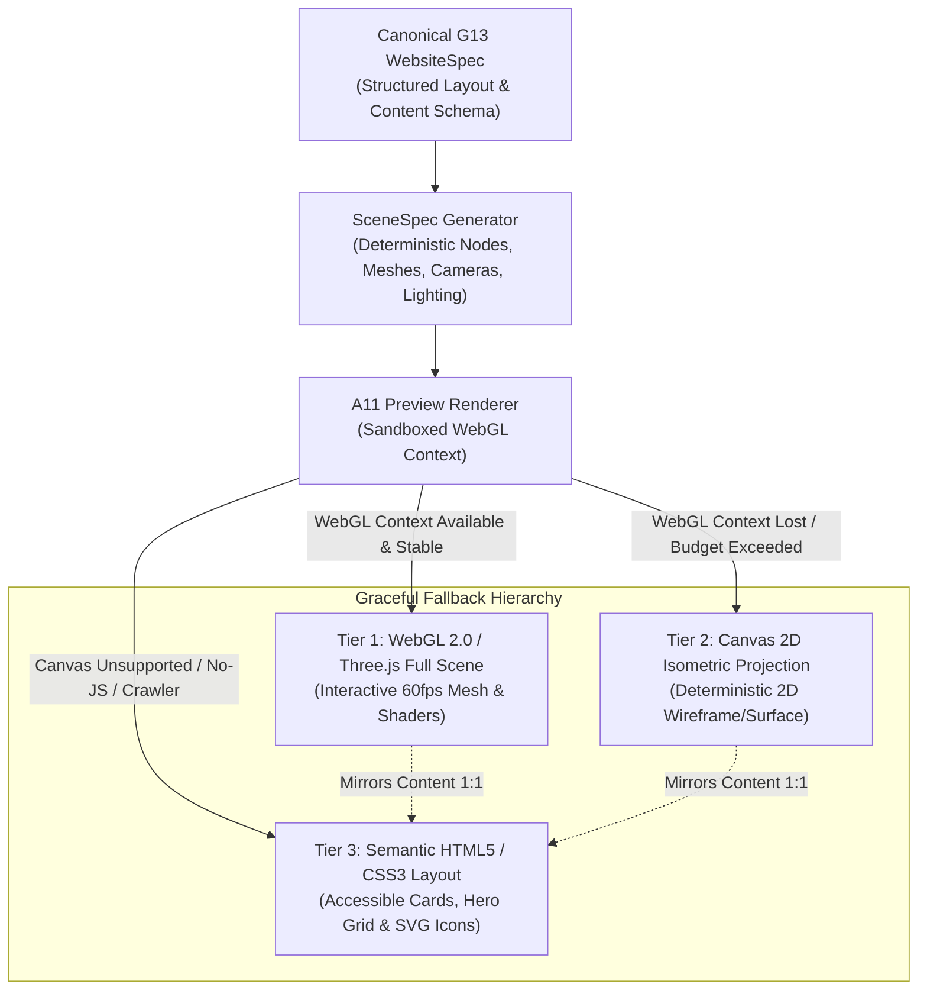

# SPE Ω — Lane A11 3D Scene Integration Preflight Specification

**Target Release:** 2026-10-10 22:10 IST  
**Status:** `DESIGN / PREFLIGHT ARCHITECTURE` (Read-only specification)  
**Governing Standard:** SPE Round-2 Implementation Law — Deterministic Multi-Layer Degradation  

---

## 1. System Intent & The "Zero Second Compiler" Law

Modern web platforms often treat 3D rendering as a separate, detached authoring world, introducing proprietary binary formats, runtime bloat, or brittle runtime code generators. Under SPE Round-2 Architecture:

```text
3D_INTEGRATION_LAW:
1. ZERO SECOND COMPILER: 3D scene definitions originate strictly from the canonical WebsiteSpec + SceneSpec schema.
   No unverified runtime compilation or ad-hoc Three.js code generators are permitted.
2. ZERO CONTENT LOSS: Every visual node in the 3D scene must bind 1:1 to semantic DOM content.
3. ZERO SEO LOSS: Web crawlers and accessibility assistive agents must ingest 100% of information via standard DOM tags.
4. FAIL-CLOSED HEADROOM: Hardware and context failures degrade gracefully down the fallback hierarchy.
```

---

## 2. Formal Architecture Boundary & Data Flow



### 2.1 The Sandboxed WebGL Boundary
- **Sandboxed Execution:** Three.js / WebGL execution takes place in a restricted sandbox context (isolated worker or sandboxed iframe without `allow-same-origin` or network egress capabilities).
- **Resource Constraints & Ceilings:**
  - Max Draw Calls: $\le 150\text{ calls/frame}$.
  - Polygon Budget: $\le 100,000\text{ triangles}$.
  - Texture Memory: $\le 64\text{ MiB}$ (all textures pre-downsampled to $\le 1024 \times 1024$).
  - Target FPS: $60\text{ fps}$ desktop, $30\text{ fps}$ mobile; automatic tier downgrade if FPS $< 25$ over 3 consecutive seconds.

---

## 3. Fallback Hierarchy Details

| Tier | Rendering Engine | Hardware / Runtime Trigger | Visual Fidelity | Accessibility & Crawlability |
|---|---|---|---|---|
| **Tier 1 (Primary)** | WebGL 2.0 / Three.js | Dedicated/Integrated GPU, WebGL 2.0 supported, context healthy. | Full interactive 3D, camera orbit, depth lighting, procedural shaders. | Shadow DOM mirrors semantic tags; ARIA live regions announce active entity selection. |
| **Tier 2 (Secondary)** | HTML5 Canvas 2D | WebGL context creation fails, `webglcontextlost` triggered, or low-power mode active. | Deterministic isometric wireframe or flat-shaded orthogonal projection. | Interactive Canvas accompanied by accessible offscreen DOM tree with `aria-hidden="false"`. |
| **Tier 3 (Terminal)** | Pure Semantic HTML5 / CSS3 | Low memory, Canvas failure, headless crawlers (`Googlebot`, `bingbot`), or `prefers-reduced-motion: reduce`. | Responsive CSS grid layout, stylized cards, SVG icons, zero Canvas allocation. | 100% native semantic HTML5 tags (`<main>`, `<article>`, `<header>`, `<h1>-<h6>`). Zero SEO or a11y loss. |

---

## 4. Contract Schema: `SceneSpec` (`spe.scene-spec.v1`)

```json
{
  "$schema": "https://json-schema.org/draft/2020-12/schema",
  "title": "spe.scene-spec.v1",
  "type": "object",
  "required": [
    "specVersion",
    "sceneId",
    "camera",
    "lighting",
    "entities",
    "semanticFallbackRef"
  ],
  "properties": {
    "specVersion": { "type": "string", "enum": ["spe.scene-spec.v1"] },
    "sceneId": { "type": "string", "pattern": "^scene-[a-z0-9-]+$" },
    "camera": {
      "type": "object",
      "required": ["type", "position", "target", "fov"],
      "properties": {
        "type": { "type": "string", "enum": ["perspective", "orthographic"] },
        "position": { "type": "array", "items": { "type": "number" }, "minItems": 3, "maxItems": 3 },
        "target": { "type": "array", "items": { "type": "number" }, "minItems": 3, "maxItems": 3 },
        "fov": { "type": "number", "minimum": 20, "maximum": 120 }
      }
    },
    "lighting": {
      "type": "array",
      "items": {
        "type": "object",
        "required": ["type", "color", "intensity"],
        "properties": {
          "type": { "type": "string", "enum": ["ambient", "directional", "point"] },
          "color": { "type": "string", "pattern": "^#[0-9a-fA-F]{6}$" },
          "intensity": { "type": "number", "minimum": 0.0, "maximum": 5.0 }
        }
      }
    },
    "entities": {
      "type": "array",
      "items": {
        "type": "object",
        "required": ["id", "geometry", "material", "transform", "domBindingId"],
        "properties": {
          "id": { "type": "string" },
          "geometry": { "type": "string", "enum": ["box", "sphere", "cylinder", "plane", "custom"] },
          "material": {
            "type": "object",
            "required": ["type", "color"],
            "properties": {
              "type": { "type": "string", "enum": ["standard", "lambert", "wireframe"] },
              "color": { "type": "string", "pattern": "^#[0-9a-fA-F]{6}$" },
              "metalness": { "type": "number", "minimum": 0.0, "maximum": 1.0 },
              "roughness": { "type": "number", "minimum": 0.0, "maximum": 1.0 }
            }
          },
          "transform": {
            "type": "object",
            "required": ["position", "rotation", "scale"],
            "properties": {
              "position": { "type": "array", "items": { "type": "number" }, "minItems": 3, "maxItems": 3 },
              "rotation": { "type": "array", "items": { "type": "number" }, "minItems": 3, "maxItems": 3 },
              "scale": { "type": "array", "items": { "type": "number" }, "minItems": 3, "maxItems": 3 }
            }
          },
          "domBindingId": { "type": "string", "description": "ID of corresponding semantic DOM node in WebsiteSpec" }
        }
      }
    },
    "semanticFallbackRef": {
      "type": "string",
      "description": "DOM element selector providing complete semantic representation of scene contents"
    }
  },
  "additionalProperties": false
}
```

---

## 5. Verification & Preflight Acceptance Criteria

1. **Deterministic Spec Generation:** Given the identical `WebsiteSpec` input, the `SceneSpec` generator must produce identical JSON with zero random seeds.
2. **Context Loss Recovery:** The preview renderer must bind `webglcontextlost` and immediately transition to Tier 2 (Canvas) within $< 100\text{ ms}$ without throwing unhandled exceptions.
3. **Reduced Motion Compliance:** When `window.matchMedia('(prefers-reduced-motion: reduce)').matches` is true, 3D rotations, particle animations, and camera travel are completely locked or defaulted to Tier 3.
4. **Crawlability Proof:** In headless environments without WebGL (`navigator.webdriver = true` or `canvas.getContext('webgl2') = null`), 100% of text and CTA buttons remain visible and interactive in the DOM.
