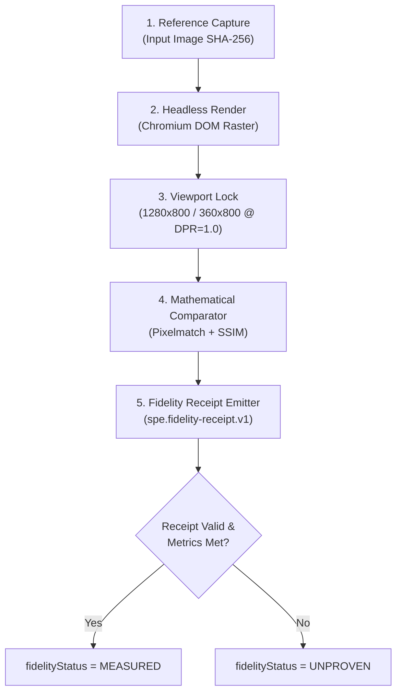

# SPE Ω — Lane A12 Visual Fidelity-Proof Architecture

**Target Release:** 2026-10-10 22:10 IST  
**Status:** `DESIGN / PROOF ARCHITECTURE` (Read-only specification)  
**Governing Standard:** SPE Round-2 Implementation Law — Fail-Closed Parity Verification  

---

## 1. Problem Statement & The "Anti-Vibe" Mandate

Commercial AI code-generation products frequently assert subjective parity claims (e.g., *"100% pixel-perfect recreation"* or *"exact visual copy"*). Under SPE Round-2 Law, all such unmeasured claims are strictly banned.

```text
FIDELITY_CLAIM_LAW:
Parity is a mathematical relationship between two raster arrays under identical viewport constraints.
Without an attached, hash-chained Fidelity Receipt:
fidelityStatus = UNPROVEN (FAIL-CLOSED)
```

---

## 2. Five-Stage Fidelity Pipeline

To transition any visual artifact from `UNPROVEN` to `MEASURED`, the system must execute the following five-stage determinism pipeline:



### Stage 1: Reference Ingestion
- Input screenshot or UI mock is normalized to raw PNG/WebP.
- Canonical SHA-256 digest is calculated over raw bytes (`referenceSha256`).

### Stage 2: Controlled Headless Render
- The emitted HTML/CSS/JS is rendered in a dedicated headless Chromium instance via Playwright.
- System properties are locked:
  - Font smoothing: Subpixel antialiasing disabled (grayscale antialiasing for cross-platform stability).
  - Web fonts: Must wait for `document.fonts.ready`.
  - CSS animations: Forced `animation-duration: 0s !important` and `transition-duration: 0s !important`.
  - Device scale factor: Explicitly locked to `1.0`.

### Stage 3: Viewport Normalization
Two standard viewports are captured:
1. **Desktop Viewport:** $1280 \times 800\text{ px}$.
2. **Mobile Viewport:** $360 \times 800\text{ px}$ (WCAG 1.4.10 reflow standard).

### Stage 4: Mathematical Comparison Engine
The comparator runs two complementary algorithms:
1. **Structural Similarity Index (SSIM):**
   $$SSIM(x, y) = \frac{(2\mu_x\mu_y + C_1)(2\sigma_{xy} + C_2)}{(\mu_x^2 + \mu_y^2 + C_1)(\sigma_x^2 + \sigma_y^2 + C_2)}$$
   - Minimum threshold for `MEASURED_HIGH_FIDELITY`: $SSIM \ge 0.95$.
2. **Normalized Pixel Delta (Pixelmatch):**
   - Color delta threshold: $\Delta E_{00} \le 2.0$.
   - Mismatched pixel budget: $\le 5.0\%$ of total viewport pixels.

---

## 3. Fidelity Receipt Specification (`spe.fidelity-receipt.v1`)

```json
{
  "$schema": "https://json-schema.org/draft/2020-12/schema",
  "title": "spe.fidelity-receipt.v1",
  "type": "object",
  "required": [
    "receiptId",
    "timestamp",
    "referenceSha256",
    "renderSha256",
    "viewport",
    "ssimScore",
    "pixelDeltaPercentage",
    "fidelityStatus"
  ],
  "properties": {
    "receiptId": { "type": "string", "pattern": "^rcpt-[a-f0-9]{16}$" },
    "timestamp": { "type": "string", "format": "date-time" },
    "referenceSha256": { "type": "string", "pattern": "^[a-f0-9]{64}$" },
    "renderSha256": { "type": "string", "pattern": "^[a-f0-9]{64}$" },
    "viewport": {
      "type": "object",
      "required": ["width", "height", "devicePixelRatio"],
      "properties": {
        "width": { "type": "integer" },
        "height": { "type": "integer" },
        "devicePixelRatio": { "type": "number", "enum": [1.0] }
      }
    },
    "ssimScore": { "type": "number", "minimum": 0.0, "maximum": 1.0 },
    "pixelDeltaPercentage": { "type": "number", "minimum": 0.0, "maximum": 100.0 },
    "fidelityStatus": { "type": "string", "enum": ["UNPROVEN", "MEASURED"] }
  },
  "additionalProperties": false
}
```

---

## 4. UI Invariant Protection

In [`VisualScreenshotWorkspace.tsx`](file:///Volumes/4TB-WD/spe-worktrees/spe-staging-round2-qual/apps/web/src/media/VisualScreenshotWorkspace.tsx):
- The status pill defaults unconditionally to `UNPROVEN`.
- The `fidelityStatus` property is read-only and cannot be mutated by user input or LLM generation tokens.
- AST unit tests verify that any component attempting to claim "100% pixel perfect" without an accompanying `fidelityReceipt` fails with `AssertionError`.
