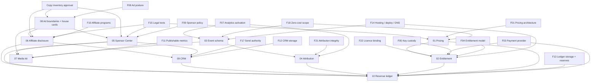

# C0 DEPENDENCY_GRAPH

Nodes are C0 specs (`S01`–`S10`), founder decisions (`F##`, see register) and external gates. An
edge `A --> B` means B depends on A.

## Readiness by spec (docs vs implementation)

| Spec | Draftable now (docs) | Implementable only after |
| --- | --- | --- |
| 01 Pricing | ✔ (this PR) | F01, F02, F18, F15 |
| 02 Entitlement | ✔ | F04, F05, F22, F03, F14 |
| 03 Event schema | ✔ | F07, F14, F18 |
| 04 Attribution | ✔ | 03 implemented, F07, F10, F21 (option B also needs F14) |
| 05 Sponsor Center | ✔ | 08, F09, F15, F17, live surface (F14) |
| 06 Affiliate disclosure | ✔ | 08, F10, F15 |
| 07 Media kit | ✔ (template) | 03 measuring, F11 |
| 08 Ad boundaries + house cards | ✔ | F08, copy approval (E12), live surface (F14) |
| 09 CRM | ✔ | F12, F17 |
| 10 Revenue ledger | ✔ | F13, F02, F03 |

**Critical path to any self-serve revenue:** F14 → F18 → F01, F04 → F03 → S02 and S10 qualified →
founder go-live.

**SERVICES path (may operate manually without product infrastructure):** F20 → F15 → F12, F13 →
S09 and S10 (manual evidence) → founder-signed contract. It needs no checkout, entitlement,
collector or public ad surface.

**SPONSOR INVENTORY path (NOT infrastructure-free):** contracting and invoicing may be manual (F09
→ F15 → F12, F13 → S09, S10 manual evidence), but delivering the placement still requires an
approved public surface: F14 (hosting/deploy) → F08 → S08 house-card renderer plus E12 copy
approval → S05 → live placement. A sponsor contract must not be signed for a placement that has no
approved, live surface to deliver it.
