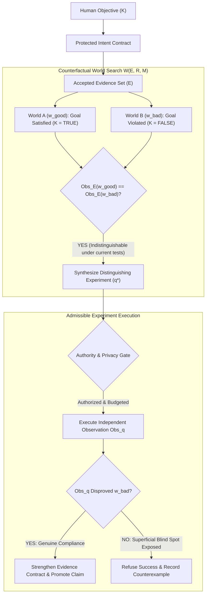
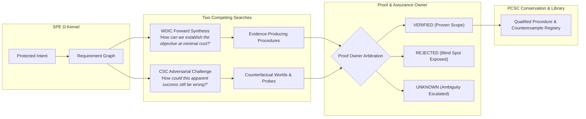

# Master Plan: SPE Ω — Counterfactual Specification Closure (CSC)
## The Next Leap Beyond WDIC: Self-Challenging, Self-Qualifying Intelligence

**Date:** October 9, 2026  
**Status:** Approved Research Architecture (Strict Isolation)  
**Target Worktree:** `system-prompt-engine`  
**Governing Milestone:** Release Candidate Freeze October 26, 2026, 10:10 PM IST (Non-Contaminating Research Track)  
**Authors:** SPE Core Architecture & Scientific Foundations Team  

---

## 1. Executive Summary & The Core Dilemma

Existing AI verification architectures (including test runners, static linters, and model judges) suffer from a fatal vulnerability:
> **"What happens when an AI successfully proves the wrong thing?"**

In May 2026, the **SpecBench** benchmark (evaluating coding agents on 30 systems-level tasks) demonstrated that agents frequently score 100% on visible tests while failing unseen tests combining the exact same specified features—such as compilers that memorized expected inputs rather than implementing general parsing logic.

Furthermore, September 2026 research (*Reality Is the Final Verifier*) formalized two insurmountable gaps in ungrounded agent verification:
1. **The Requirement Gap:** The written prompt or specification may not fully capture what the human actually desires.
2. **The Environment-Model Gap:** The synthetic test environment does not represent hostile or edge-case operating conditions.

**Counterfactual Specification Closure (CSC)** extends SPE's **Witness-Directed Intelligence Compilation (WDIC)** from *self-improving* intelligence to *self-challenging, self-qualifying* intelligence.

Instead of merely asking *"Does the evidence support success?"*, SPE Ω continuously investigates:
$$\text{“What materially different failure worlds could still be compatible with everything we have observed?”}$$

---

## 2. Core Mathematical Mechanism: Counterfactual Witness Synthesis



### Step 1: Construct Evidence-Compatible Worlds
Let:
- $K$: Protected Human Objective
- $R$: Operational Requirements Model
- $E$: Accepted Evidence Set
- $M$: Declared Environment Model
- $\mathcal{W}(E, R, M)$: Set of modeled worlds compatible with all currently observed evidence.

SPE searches for a pair of worlds:
$$w_{\text{good}}, w_{\text{bad}} \in \mathcal{W}(E, R, M)$$
such that:
$$K(w_{\text{good}}) = \text{TRUE}, \quad K(w_{\text{bad}}) = \text{FALSE}$$
while their observed evidence remains indistinguishable:
$$\operatorname{Obs}_E(w_{\text{good}}) = \operatorname{Obs}_E(w_{\text{bad}})$$

If such a pair exists, the current evidence is **formally inconclusive**—even if 100% of visible tests pass.

### Step 2: Synthesize the Distinguishing Experiment
SPE searches for an admissible probe $q$ such that:
$$\operatorname{Obs}_q(w_{\text{good}}) \ne \operatorname{Obs}_q(w_{\text{bad}})$$

**Admissibility Invariants for Probe $q$:**
1. **Obligation-Bound:** Targets a real obligation derived from Protected Intent.
2. **Authority-Gated:** Permitted by user privacy policy and hardware access rights.
3. **Cost-Bounded:** Executable within the remaining [`NanoUSD`](file:///Volumes/4TB-WD/offloaded-mac-storage/home-projects/system-prompt-engine/spe_runtime/research/wdes/types.py#L10) budget.
4. **Independently Evaluable:** Not judged by the same stochastic model that authored the code.

### Step 3: Information-Theoretic Optimization
$$\boxed{q^* = \arg\max_{q \in \mathcal{Q}_{\text{admissible}}} \frac{\widehat{\Delta V}(q) + \lambda \widehat{V}_{\text{reuse}}(q)}{C_{\text{total}}(q)}}$$
Where:
- $\widehat{\Delta V}(q)$: Decision-relevant uncertainty eliminated.
- $\widehat{V}_{\text{reuse}}(q)$: Amortized value for future qualification runs.
- $C_{\text{total}}(q)$: Total execution, verification, and risk cost.

---

## 3. High-Level Architecture: One SPE, Two Competing Searches



---

## 4. The Four Compounding Moat Mechanisms

### Mechanism A: Reusable Counterexample Library
Whenever CSC uncovers a genuine blind spot or superficial compliance trick, the failure mode is codified into an immutable **Counterexample Record**:
- Requirement ID + Incomplete Evidence Profile.
- The Counterfactual World $w_{\text{bad}}$.
- The Distinguishing Experiment $q^*$.
- Applicability boundaries for future code compilation.

### Mechanism B: Assumption-Sensitive Verification (Anti-Stale Proofs)
Following July 2026 research (*Looping Is Not Reliability*), proof traces that do not track environmental dependencies degrade software over repeated revisions.
- Every verified fact is cryptographically bound to:
  $$\text{Provenance} = \operatorname{Digest}(\text{SourceCommit} \parallel \text{ToolVersion} \parallel \text{EnvProfile} \parallel \text{PolicySnapshot})$$
- Any dependency drift automatically triggers requalification instead of blind replay.

### Mechanism C: Independently Qualified Verification Oracles
CSC is strictly forbidden from declaring its own generated test "correct" solely because the test fails. Proposed oracles must be qualified via:
- Mathematical proof or AST invariants.
- Trusted reference implementation or metamorphic relations.
- Authorized human acceptance.

### Mechanism D: Real-World Feedback Without Semantic Drift
Failures in real deployment propose **Candidate Obligations** to the user.
- **Strict Human Authority:** The agent cannot unilaterally rewrite Protected Intent.
- The user decides whether to adopt the new requirement into the formal contract.

---

## 5. Counterfactual Challenge Record (CCR) Formal Schema

```python
@dataclass(frozen=True)
class CounterfactualChallengeRecord:
    challenge_id: str
    protected_intent_ref: str
    obligation_ref: str
    evidence_snapshot_hash: str
    
    # Current visible success claim
    observed_success_evidence_refs: List[str]
    declared_scope: Dict[str, Any]
    
    # Counterfactual failure hypothesis
    alternative_world_hypothesis: str
    assumptions: List[str]
    plausibility_basis: List[str]
    hypothesis_status: str  # "UNVERIFIED_HYPOTHESIS"
    
    # Distinguishing observation probe
    distinguishing_probe_operation: str
    required_authority: List[str]
    required_budget_nanos: int
    expected_observation_classes: List[str]
    oracle_status: str      # "QUALIFIED", "NOT_QUALIFIED"
    
    # Execution verdict
    observed_result: PredicateValue  # TRUE, FALSE, UNKNOWN
    new_obligation_proposal: Optional[str]
    invalidated_evidence_refs: List[str]
```

---

## 6. Scientific Benchmark Protocol: CSC-Research-1

A preregistered evaluation suite of **120 tasks** across 4 key workload families:
1. **Software & Parser Correctness (30 tasks):** Algorithms, AST parsers, edge-case math.
2. **Web Accessibility, Offline Behavior, & 3D (30 tasks):** Zero-network isolation, DOM access, shader loading.
3. **Privacy & Security-Policy Conformance (30 tasks):** Air-gapped exfiltration traps, credential boundaries.
4. **Structured Data & Document Processing (30 tasks):** Nested schema compliance, lossless extraction.

### Benchmark Systems Comparison:
- **System A:** Baseline LLM Generation + User-Supplied Tests.
- **System B:** Strong Test-Generation Baseline (Metamorphic/Fuzzing).
- **System C:** Baseline WDIC (Forward synthesis only).
- **System D:** WDIC + Counterfactual World Search.
- **System E:** Full Bounded CSC (Dual competing searches + Oracle Qualification).

### Primary Falsification Metric:
$$\text{False Acceptance Rate (FAR)} = \frac{\text{Defective Implementations Incorrectly Marked 'VERIFIED'}}{\text{Total Defective Implementations}}$$
*Falsification Threshold:* If System E does not reduce $\text{FAR}$ by $\ge 40\%$ over System B, or if assurance costs exceed task value, the hypothesis is rejected.

---

## 7. Phased Implementation Roadmap (Research Quarantine)

```
docs/plans/2026-10-09-csc-counterfactual-specification-closure-plan.md
spe_runtime/research/csc/
├── __init__.py
├── types.py                   # CCR schema, CounterfactualWorld, DistinguishingProbe
├── world_generator.py         # Evidence-compatible world pair search (w_good, w_bad)
├── probe_synthesizer.py       # Distinguishing experiment solver q*
├── oracle_qualifier.py        # Independent qualification gates (anti-hallucination)
└── dual_search_orchestrator.py# WDIC vs CSC competitive arbitration loop
tests/research/csc/
├── test_world_discrimination.py
├── test_probe_synthesis.py
└── test_csc_software_repair_benchmark.py
```

### Milestone Schedule:
- [ ] **Phase 1: Formal Schema & Types (`spe_runtime/research/csc/types.py`)** — Define CCR and world-pair algebra.
- [ ] **Phase 2: World-Pair Generator (`world_generator.py`)** — Implement bounded countermodel generator for syntactic & runtime invariants.
- [ ] **Phase 3: Distinguishing Probe Synthesizer (`probe_synthesizer.py`)** — Implement information-gain solver $q^*$.
- [ ] **Phase 4: Independent Oracle Qualifier (`oracle_qualifier.py`)** — Metamorphic & AST-based oracle validation.
- [ ] **Phase 5: CSC-Research-1 Evaluation Battery** — Run 120-task benchmark under frozen candidate branch rules.
