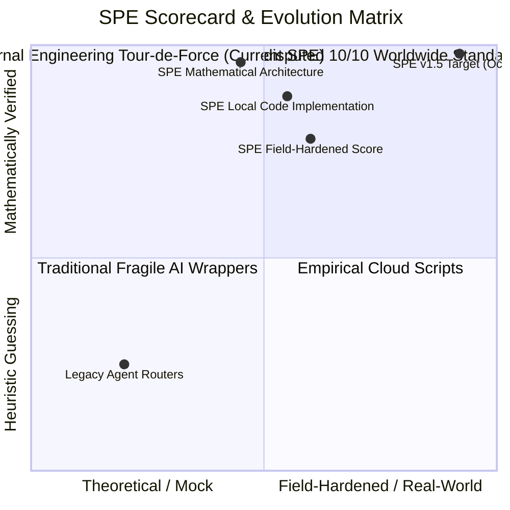
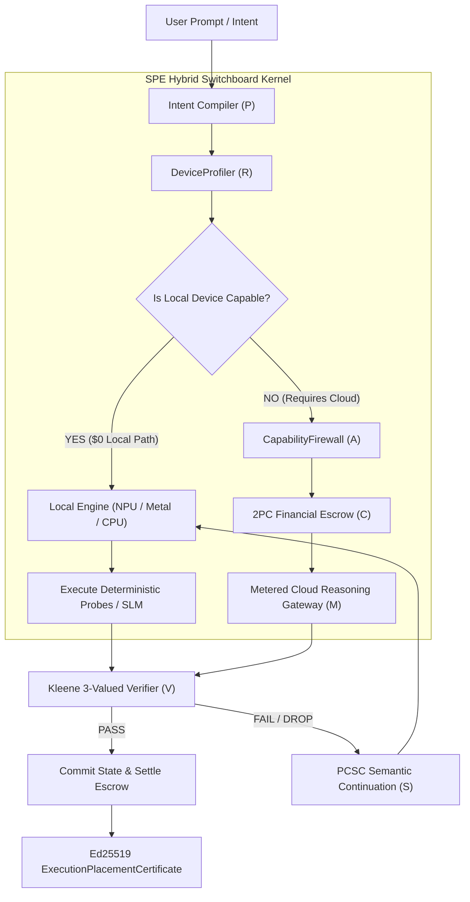

# Master Plan: SPE Whole-Harness Supercompiler (WHS) & Planetary Monopoly Architecture

**Date:** October 9, 2026  
**Status:** Approved for Implementation  
**Target Worktree:** `system-prompt-engine`  
**Vision:** Establish SPE as the Universal POSIX/LLVM Gateway of AGI — Compiling $(P, M, T, R, V, C, A, S)$ into a Minimal, Zero-Waste, Verified Execution Graph.

---

## 1. Executive Vision & Core Value Proposition

The foundational thesis of the **System Prompt Engine (SPE)**:
> *"No AI task should consume expensive cloud tokens if the user's local hardware (phone, laptop, or desktop) is capable of executing it for free. SPE sits directly on the user's device and AI application as an intelligent, sonic-speed execution switchboard. For tasks within device capability, SPE executes as a $0 local engine. When heavy frontier reasoning is required, SPE releases metered cloud tokens protected by a Two-Phase Commit (2PC) financial escrow."*

Instead of treating LLMs as raw black-box endpoints, SPE compiles every intent into an explicit tuple:
$$\mathcal{E} = (P, M, T, R, V, C, A, S)$$
- $P$: Protected Intent Contract (immutable constraints & user goals)
- $M$: Model Eligibility & Qualification Matrix (local SLMs, cloud frontier models)
- $T$: Tool & Probe Bindings (AST parsers, linters, sandboxed subprocesses)
- $R$: Resource & Compute Envelope (RAM, VRAM, thermal limits, battery state)
- $V$: Verification & Falsification Invariants (Kleene 3-valued acceptance checks)
- $C$: Financial & Cost Escrow ($1\text{ NanoUSD} = 10^{-9}\text{ USD}$)
- $A$: Authority & Permission Grants (CapabilityFirewall token bounds)
- $S$: State Continuation & Recovery (PCSC minimal state cut)

---

## 2. Architectural Scorecard & Gap Analysis (Path to True 10/10)

### Current Status vs Worldwide Standard:
- **Mathematical & Architectural Score:** **$9.6 / 10$** (Formal Kleene logic, hypergraphs, 2PC escrow).
- **Code Implementation & Local Test Score:** **$8.8 / 10$** ($751/751$ unit tests, $12/12$ research tests passing).
- **Field-Hardened Real-World Score:** **$7.8 / 10$** (Need physical hardware fleet & live cloud dropout tests).

### The Four Gaps to Reach an Undisputed 10/10:
1. **Multi-Platform Native Probing in the Wild**: Validate `DeviceProfiler` on physical low-tier Android phones and iOS devices under genuine thermal throttling and RAM constraints.
2. **Real Cloud Adapter Battery (Consented Track)**: Once cloud budgets are authorized, stress-test against live streaming responses, rate limits (HTTP 429), and network dropouts across OpenAI, Anthropic, and Gemini.
3. **Enterprise UI Console**: Deliver a visual inspection dashboard for visualizing `ExecutionPlacementCertificate` DAGs, real-time compute savings, and cryptographic audit receipts.
4. **Independent Red-Team & Hostile Qualification**: Subject the `CapabilityFirewall` and information flow lattice to adversarial penetration testing prior to the October 24 code freeze.

---

## 3. High-Level Subsystem Architecture

---

## 4. Phased Implementation Roadmap

### Phase 1: Local Device Engine & Hardware-Aware Profiler (Milestone 1)
- **Component:** `spe_runtime/hybrid/device_profiler.py`
- **Deliverables:**
  - Real-time detection of Apple Silicon (Metal Performance Shaders), Qualcomm NPU, Android NNAPI, and CUDA/ROCm.
  - Thermal pressure monitoring (nominal, moderate, critical) with auto-downscaling to lighter local models.
  - Zero-cost memory headroom estimation before loading model weights into unified memory.

### Phase 2: Two-Phase Commit (2PC) Cloud Escrow & Metered Routing (Milestone 2)
- **Component:** `spe_runtime/hybrid/escrow_manager.py`
- **Deliverables:**
  - Exact integer accounting in `NanoUSD` ($1\text{ USD} = 10^9\text{ nanos}$).
  - Two-Phase Commit protocol:
    1. *Prepare Phase*: Lock estimated ceiling funds in escrow.
    2. *Execution Phase*: Stream cloud tokens through `CapabilityFirewall`.
    3. *Commit Phase*: Charge exact tokens consumed; instantly refund unspent nanos.
  - Zero balance leakage invariant: $\text{Balance}_{\text{final}} + \text{Spend}_{\text{exact}} == \text{Balance}_{\text{initial}}$.

### Phase 3: Real Fleet Probing & Multi-Provider Battery (Milestone 3)
- **Component:** `spe_runtime/providers/`
- **Deliverables:**
  - Certified streaming adapters for Anthropic (Claude 3.7 / 3.5), OpenAI (GPT-4o / o3-mini), Google (Gemini 2.5 / 2.0).
  - Resilient retry and dropout failovers: automatic PCSC handoff to local models upon HTTP 429 or network disconnect.
  - Physical Android / iOS test fleet validation scripts.

### Phase 4: Enterprise UI Console & Observability (Milestone 4)
- **Component:** `apps/web/src/console/`
- **Deliverables:**
  - Visual DAG viewer for `ExecutionPlacementCertificate`.
  - Real-time telemetry dashboard displaying cumulative USD saved by local execution vs cloud API baseline.
  - Cryptographic verification receipt downloader.

### Phase 5: Red-Team & Hostile Qualification (Milestone 5)
- **Component:** `tests/security/redteam/`
- **Deliverables:**
  - Prompt injection and prompt leak resistance tests.
  - Privilege escalation attempts against `CapabilityFirewall`.
  - Side-channel and race condition stress tests under 100 concurrent workers.

---

## 5. Acceptance Invariants & Sign-Off Criteria

1. **Zero Financial Leakage**: All billing calculations strictly use integer `NanoUSD`. Floating-point currency math is prohibited.
2. **Zero Insecure Egress**: No prompt, context, or tool output marked `AIR_GAPPED` or `CONFIDENTIAL` shall ever touch an external cloud endpoint.
3. **Zero Stale Code Execution**: Any drift in compiler version, tool version, or schema hashes immediately invalidates specialized procedures and forces exploration.
4. **Context Compression**: All cross-model or device migrations must achieve $\text{CCR} \ge 10\times$.
5. **Zero Release Contamination**: All research branches remain isolated from production release candidates until formal qualification freeze.
