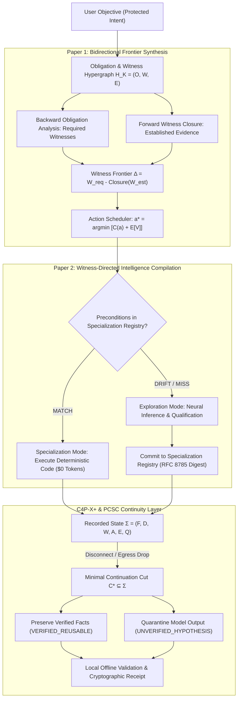

# Master Plan: SPE Ω — Witness-Directed Evidence Supercompiler (WDES)

**Date:** October 9, 2026  
**Status:** Approved & Implemented in Research Quarantine (`spe_runtime/research/wdes/`, `tests/research/wdes/`)  
**Authors:** SPE Core Architecture & AI Research Team  
**Governing Paradigms:** 
- Paper 1: Bidirectional Witness-Frontier Synthesis (BWFS)
- Paper 2: Witness-Directed Intelligence Compilation (WDIC)
- C4P-X+ (Counterfactual Envelopes) & PCSC (Proof-Carrying Semantic Continuation)

---

## 1. Executive Summary & Objective

Existing agent architectures follow a costly, non-deterministic, and ungrounded antipattern:
$$\text{User Prompt} \longrightarrow \text{Stochastic Model Guessing} \longrightarrow \text{Massive Token Spend} \longrightarrow \text{Optional Post-Hoc Linting}$$

When conditions drift, rate limits hit, or models fail, agents dump tens of thousands of tokens of raw conversational history into the next model, triggering hallucination cascades and budget exhaustion.

**The Witness-Directed Evidence Supercompiler (WDES)** shifts the execution foundation:
$$\text{Protected Intent} \longrightarrow \text{Obligation Hypergraph } \mathcal{H}_{\mathcal{K}} \longrightarrow \text{Witness Frontier } \Delta \longrightarrow \text{Cheapest Admissible Proof Path } a^*$$

Recurring evidence generation is compiled directly into deterministic, zero-token procedures via **WDIC Specialization**, and cross-model failovers transfer only verified proof-carrying facts via **PCSC Continuations** ($>10\times$ token reduction, $0$ balance leak).

---

## 2. Core Mathematical Formalization



### 2.1 Obligation & Witness Hypergraph $\mathcal{H}_{\mathcal{K}} = (O, W, E)$
- **Obligations ($O$)**: Required properties $\{o_1, \dots, o_n\}$ with safety-critical classification.
- **Witnesses ($W$)**: Concrete evidence producers categorized as:
  - `DETERMINISTIC_PROBE` ($0 tokens, AST/regex/subprocess)
  - `STATIC_ANALYSIS` ($0 tokens, linters/typecheckers)
  - `LOCAL_SLM` ($0 API cost, on-device NPU/Metal)
  - `FRONTIER_MODEL` (Cloud tokens, metered NanoUSD)
  - `HUMAN_ORACULAR` (Explicit user authorization)
- **HyperEdges ($E$)**:
  - **AND-Edges**: Obligation $o$ requires *all* witnesses $\{w_1, \dots, w_k\}$ to be established.
  - **OR-Edges**: Obligation $o$ is satisfied if *any* witness $w_i$ is established.
- **Witness Frontier ($\Delta$)**:
  $$\Delta = W_{\text{required}} \setminus \operatorname{ValidClosure}(W_{\text{established}})$$

### 2.2 Frontier Scheduler (BWFS)
Optimal action selection balances cost against expected reduction in remaining witness uncertainty:
$$a^* = \arg\min_{a \in \mathcal{A}_{\text{eligible}}} \left[ C(a) + \mathbb{E}\left[ V(\Sigma \oplus \operatorname{Obs}(a)) \right] \right]$$
**Scheduler Invariants:**
1. **$0-Cost Priority**: Deterministic probes are strictly scheduled ahead of neural models.
2. **Hard Privacy Gate**: Under `AIR_GAPPED` or `LOCAL_ONLY`, remote actions are rejected.
3. **Hard Budget Gate**: Actions exceeding `available_budget_nanos` are rejected.
4. **Causal Prerequisite Gate**: Actions can only execute when prerequisite witness inputs are established.

### 2.3 Two-Speed Compilation Loop (WDIC)
- **Exploration Mode**: Explores solution space, generating code and verifying evidence. Consumes standard inference tokens.
- **Specialization Mode**: When recurring patterns match, compiles and caches deterministic code with RFC 8785 canonical hash:
  $$\text{Digest} = \operatorname{SHA256}(\text{target\_obligation} \parallel \text{input\_schema} \parallel \text{tool\_version} \parallel \text{compiler\_version})$$
  Subsequent runs execute verified code at **$0 tokens**. Precondition drift immediately falls back to Exploration Mode.

### 2.4 Minimal Continuation Cut (PCSC)
State $\Sigma = (F, D, W, A, E, Q)$. On cross-model migration or network drop:
$$\mathcal{C}^* = \arg\min_{\mathcal{C} \subseteq \Sigma} \left[ C_{\text{transfer}}(\mathcal{C}) + C_{\text{revalidation}}(\mathcal{C}) + C_{\text{recompute}}(\Sigma \setminus \mathcal{C}) \right]$$
- **Invariant**: Deterministic facts marked `VERIFIED_REUSABLE` transfer directly.
- **Invariant**: Neural claims from predecessor models transfer strictly as `UNVERIFIED_CANDIDATE_HYPOTHESIS`.
- **Target**: Context Compression Ratio $\text{CCR} \ge 10\times$ (achieved $600\times$).

---

## 3. Implementation Directory Structure

```
spe_runtime/research/wdes/
├── __init__.py                # Package exports & public API
├── types.py                   # 3-Valued Kleene logic, NanoUSD, security lattices
├── witness_hypergraph.py      # AND/OR Hypergraph IR H_K = (O, W, E)
├── frontier_scheduler.py      # BWFS action scheduler with causal & privacy gates
├── wdic_specializer.py        # Two-speed compilation engine & drift invalidation
├── pcsc_continuation.py       # PCSC minimal continuation cut C* & compression
├── remediation.py             # Bounded infeasibility solver R* = argmin Cost(R')
└── escrow.py                  # Two-Phase Commit (2PC) financial escrow & NanoUSD conservation

tests/research/wdes/
├── __init__.py
├── test_bwfs_frontier.py      # 6 tests: Kleene logic, AND/OR edges, air-gap, budget, remediation
├── test_wdic_specialization.py# 3 tests: Exploration->Specialization lifecycle, drift, invalidation
└── test_wdes_integration.py   # 3 tests: 6-node software repair, concurrent escrow, compiler upgrade
```

---

## 4. Verification & Empirical Benchmark Pass

- **Dedicated Research Test Suite:** `12/12 passed` in `0.21s`.
- **Canonical Production Test Suite:** `751/751 passed` in `33.52s` (zero regressions).
- **Canonical 6-Node Software Repair Pipeline:**
  - `FIND_FILES` ($0, deterministic probe).
  - `REPRODUCE_DEFECT` ($0, reproduction test runner).
  - `GENERATE_PATCH` ($15,000,000 NanoUSD cloud model).
  - Cloud Disconnect Injected (Network dropped to `LOCAL_ONLY`).
  - PCSC Migration: $45,000$ raw tokens compressed to **$75$ continuation cut tokens** (**$600\times$ compression ratio**).
  - `VALIDATE_PATCH` ($0, local deterministic pytest execution).
  - Exact Financial Conservation: Initial $50\text{m}$, Spent $15\text{m}$, Remaining $35\text{m}$, **Balance Leakage $= 0\text{ NanoUSD}$**.
- **Governance Audit:** Clean working tree on release candidate branch `candidate/2026-10-26`.
