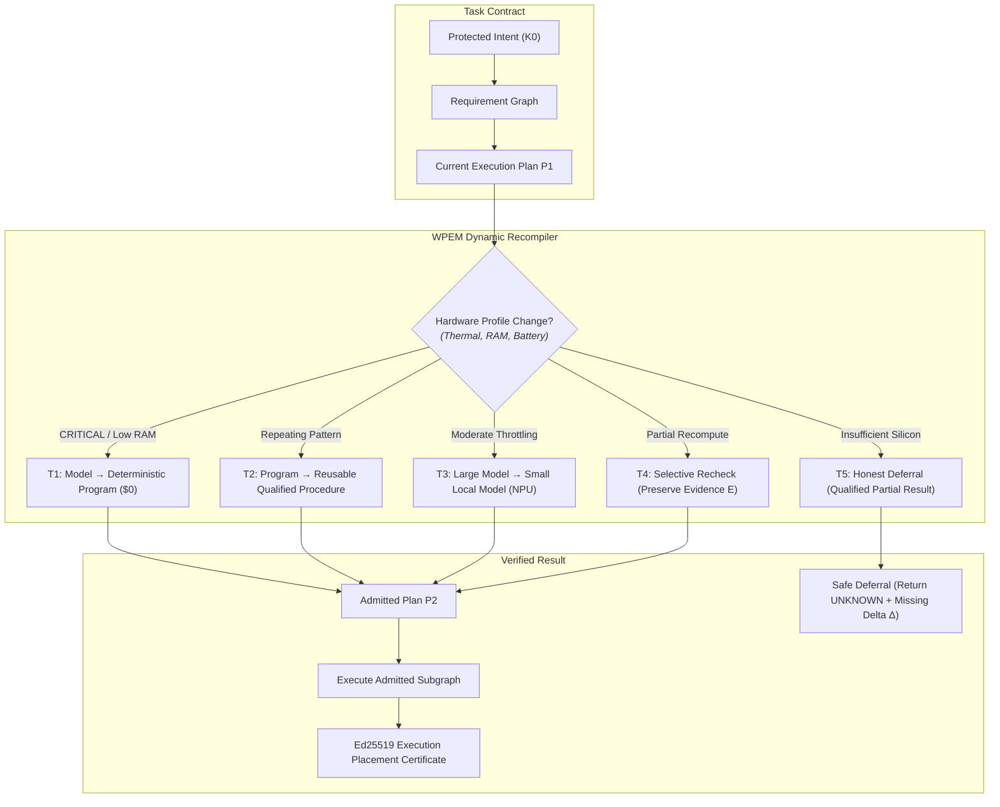

# Master Plan: SPE Ω — Witness-Preserving Execution Morphing (WPEM)
## Computational Elasticity Under Hard Semantic Invariants

**Date:** October 9, 2026  
**Status:** Approved Research Architecture (Strict Isolation)  
**Target Worktree:** `system-prompt-engine`  
**Governing Milestone:** Release Candidate Freeze October 26, 2026, 10:10 PM IST (Non-Contaminating Research Track)  
**Authors:** SPE Core Architecture & Systems Research Team  

---

## 1. Executive Summary & Problem Formulation

Standard AI routing architectures (including HybridFlow, router benchmarks, and edge-cloud splitters) ask a shallow question:
$$\text{“Which model or device should execute this prompt?”}$$

When local device accelerators overheat, available RAM drops, or battery levels fall, conventional systems face a fragile trilemma:
1. Fall back to an underpowered, unverified small model (risking hallucination and quality collapse).
2. Offload private context to the cloud (violating air-gap and spending money).
3. Fail completely.

**Witness-Preserving Execution Morphing (WPEM)** shifts the paradigm:
$$\text{“Instead of choosing where to run the task, reconstruct the execution graph itself.”}$$

WPEM enables **computational elasticity** under fixed semantic contracts:
As physical hardware envelopes contract, WPEM replaces expensive neural reasoning steps with qualified deterministic programs, preserves already established evidence, selective-rechecks only affected obligations, and honestly defers when conditions prevent justified claims.

---

## 2. Comprehensive Review & Architectural Scorecard

| Dimension | Score | Analysis & Verdict |
| :--- | :---: | :--- |
| **Conceptual Novelty** | **9.8 / 10** | Recompiling the solution graph rather than rerouting prompts is a major conceptual leap over HybridFlow, Stanford Intelligence-per-Watt, and Certificate-Gated Prefix Acceptance. |
| **Mathematical Rigor** | **9.2 / 10** | Invariant-preserving transformation tuples provide formal guarantees; requires multi-objective Lagrangian cost and compositional closure. |
| **Safety & Privacy** | **9.9 / 10** | Transformation 5 (*Honest Deferral*) strictly eliminates hallucinated certainty and enforces air-gap boundaries. |
| **Engineering Feasibility** | **8.6 / 10** | High feasibility when bounded to structured stages; requires hysteresis damping to prevent thermal thrashing. |
| **OVERALL SCORE** | **9.4 / 10** | **Top-Tier Breakthrough Candidate** for planetary AGI operating systems. |

---

## 3. Critical Gaps Identified & Algorithmic Fixes

### 🔴 Gap 1: Thermal Oscillation Thrashing (Missing Hysteresis)
- **Defect:** Mobile and laptop thermal states oscillate rapidly under heavy compute (NOMINAL $\leftrightarrow$ SERIOUS $\leftrightarrow$ CRITICAL every 2–4 seconds). Unchecked graph recompilation burns more CPU cycles and battery than the task itself.
- **Fix:** **Asymmetric Hysteresis Damping (Schmitt Trigger)**:
  - *Downgrade (Safety Path):* Instantaneous fail-safe trigger ($t_{\text{downgrade}} = 0\text{ms}$).
  - *Upgrade (Recovery Path):* Requires sustained hardware stability for $t_{\text{cooldown}} \ge 10\text{s}$ before promoting execution tier back to heavier local models.

### 🔴 Gap 2: Pathological API-Only Minimization
- **Defect:** Minimizing only $C_{\text{API}}(P)$ subject to $C_{\text{latency}} \le L_{\max}$ allows the compiler to pick an excruciatingly slow 1-bit CPU quantization taking 50 seconds to save $\$0.0001$.
- **Fix:** **Multi-Objective Lexicographic Lagrangian Cost**:
  $$\boxed{J(P) = C_{\text{API}}(P) + \alpha \cdot C_{\text{latency}}(P) + \beta \cdot C_{\text{energy}}(P) + C_{\text{revalidation}}(P)}$$
  Where $C_{\text{API}}$ is exact integer `NanoUSD`, $C_{\text{energy}}$ is integer millijoules ($\text{mJ}$), and $C_{\text{latency}}$ is milliseconds.

### 🔴 Gap 3: Compositional Soundness Invalidation Hole
- **Defect:** If transformation $T_1: A \to A'$ and $T_2: B \to B'$ are individually sound, their composition $T_2 \circ T_1$ might silently omit a joint relational requirement that neither procedure individually verifies.
- **Fix:** **Compositional Obligation Preservation Invariant (COPI)**:
  $$\operatorname{Obligations}(T_2 \circ T_1) \supseteq \operatorname{Obligations}(T_1) \cup \operatorname{Obligations}(T_2) \cup \operatorname{RelationalClosure}(A, B)$$
  Compositional rewrites must verify the joint precondition closure before admission.

### 🔴 Gap 4: In-Flight Irreversible Effect Interruption
- **Defect:** A thermal collapse occurring mid-stream during an external side-effect could leave state in an undefined half-committed state.
- **Fix:** **Two-Phase Commit (2PC) Effect Isolation**: WPEM can only rewrite *uncommitted* nodes. Nodes with status `COMMITTED_IDEMPOTENT` or `COMMITTED_IRREVERSIBLE` are frozen and immutable in the PCSC state cut $\Sigma$.

---

## 4. The Five Admissible Execution Transformations



| Transformation | Source Operation | Target Alternative | What Cannot Change |
| :--- | :--- | :--- | :--- |
| **$T_1$: Model $\to$ Program** | Stochastic neural reasoning | Qualified deterministic code (AST / Regex / Linter) | Acceptance invariants & output schemas |
| **$T_2$: Program $\to$ Procedure** | Ad-hoc program execution | Cached specialized procedure ($0 tokens) | Precondition hash & environmental bounds |
| **$T_3$: Large Model $\to$ Small Model** | Frontier cloud model | Local SLM (NPU / Metal) within tested capability envelope | Safety-critical obligations |
| **$T_4$: Full Recheck $\to$ Selective** | Total graph re-execution | Dependency-sliced delta reverification | Validity of preserved evidence |
| **$T_5$: Unsafe Execution $\to$ Deferral** | Speculative execution under pressure | Honest partial result with explicit missing delta $\Delta$ | Protected Intent, authority, privacy |

---

## 5. Formal Admissibility Predicate

An alternative execution plan $P'$ is admissible at time $t$ if and only if:
$$\operatorname{Admissible}(P', H_t, K, O, A, E) = \text{TRUE}$$

Formally defined as the conjunction of five machine-checkable invariants:
$$\begin{aligned}
\operatorname{Admissible}(P', H_t, K, O, A, E) \iff & \operatorname{StructuralPreservation}(P', O) \land \\
& \operatorname{ResourceAdmission}(P', H_t) \land \\
& \operatorname{EvidenceAdequacy}(P', E) \land \\
& \operatorname{AuthorityBound}(P', A) \land \\
& \operatorname{ThermalStability}(H_t, t_{\text{cooldown}})
\end{aligned}$$

Where:
- $\operatorname{StructuralPreservation}(P', O) \iff O \subseteq \operatorname{AccountedObligations}(P')$
- $\operatorname{ResourceAdmission}(P', H_t) \iff \text{FreeMemory}(H_t) \ge 1.5 \times \text{RequiredFootprint}(P') \land \text{BackendAvailable}(P')$
- $\operatorname{ThermalStability}(H_t, t_{\text{cooldown}}) \iff \text{State}(H_t) \neq \text{CRITICAL} \lor \text{IsDownscaled}(P')$

---

## 6. Ten Adversarial Attack Vectors & Defenses

1. **GPU Memory Race (TOCTOU):** Available memory drops between profiling and weight allocation $\implies$ Revalidate admission atomically immediately before allocation.
2. **Thermal Spike Mid-Inference:** Thermal state switches to CRITICAL during generation $\implies$ Interrupt cleanly, preserve completed token invariants, and hand off via PCSC minimal cut.
3. **Small Model Constraint Drop:** Smaller model quietly skips a non-functional constraint $\implies$ Kleene 3-valued verifier evaluates output against original $O$; marks unproven obligations `UNKNOWN`.
4. **Stale Applicability Guard:** Cached procedure runs under drifted schema $\implies$ RFC 8785 precondition hash mismatch forces fallback to exploration.
5. **Compositional Semantic Hole:** $T_2 \circ T_1$ drops cross-procedure invariants $\implies$ COPI relational closure verification gate rejects composition.
6. **Unauthorized Cloud Spillover:** Local failure attempts silent cloud fallback $\implies$ Hard capability firewall gate blocks network socket without explicit user consent.
7. **Opaque Cloud Pricing:** Provider pricing changes dynamically $\implies$ Refuse execution without pinned `NanoUSD` offline price table.
8. **Generated Verifier Hallucination:** Agent invents its own test oracle $\implies$ Independent oracle qualification required (AST proof, metamorphic relation, or human).
9. **Superficial SpecBench Memorization:** Model passes visible tests by memorization $\implies$ CSC counterfactual world search synthesizes discriminating offline probe $q^*$.
10. **Hardware Sensor Telemetry Blackout:** Thermal or RAM sensors return null/corrupted data $\implies$ Fail-closed: assume worst-case (CRITICAL / 0 free memory) and execute safe deterministic fallback.

---

## 7. Phased Implementation Gates (Research Quarantine)

```
spe_runtime/research/wpem/
├── __init__.py
├── types.py                   # TransformationTuple, HardwareEnvelope, AdmissibilityVerdict
├── graph_rewriter.py          # Dynamic execution graph recompiler (T1-T5)
├── hysteresis_filter.py       # Asymmetric thermal damping & Schmitt trigger
├── admissibility_solver.py    # Multi-objective Lagrangian constraint solver J(P)
└── compositional_guard.py     # COPI relational closure validator
tests/research/wpem/
├── test_wpem_transformations.py
├── test_thermal_hysteresis.py
├── test_hardware_collapse_recovery.py
└── test_compositional_soundness.py
```

### Research Gates:
- [ ] **Gate W0: Typed Transformation Semantics** — Formal schema, positive and negative test vectors.
- [ ] **Gate W1: Resource-State Admission** — Integration with DeviceProfiler under synthetic RAM/thermal stress.
- [ ] **Gate W2: Equivalent Execution Methods** — Deterministic parser vs neural model output equivalence benchmark.
- [ ] **Gate W3: Evidence-Preserving Recompilation** — Mid-execution thermal collapse simulation with PCSC continuity.
- [ ] **Gate W4: Comparative Benchmark** — Measure latency, energy (mJ), and NanoUSD savings vs baseline HybridFlow.
- [ ] **Gate W5: Independent Multi-Platform Qualification** — Physical tests on Apple Silicon, Qualcomm NPU, and x86 Linux.
